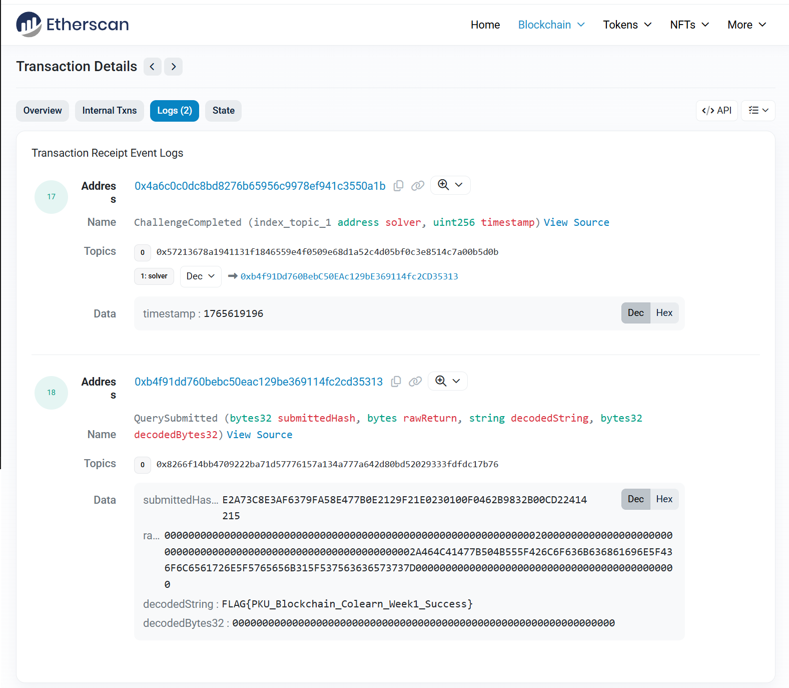
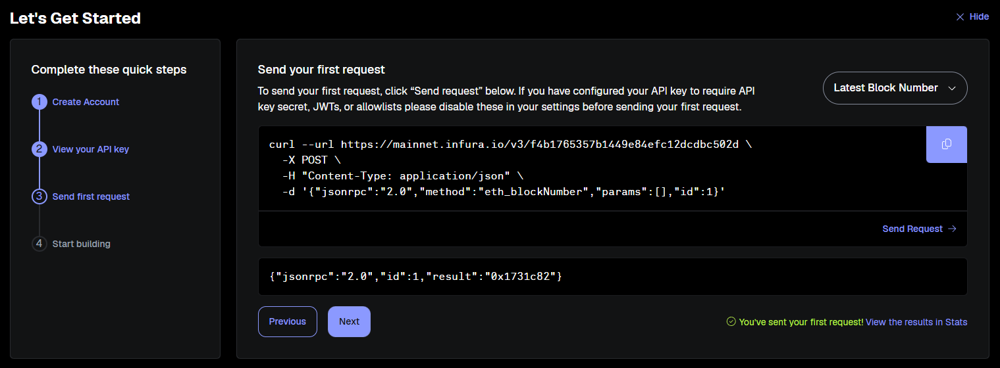
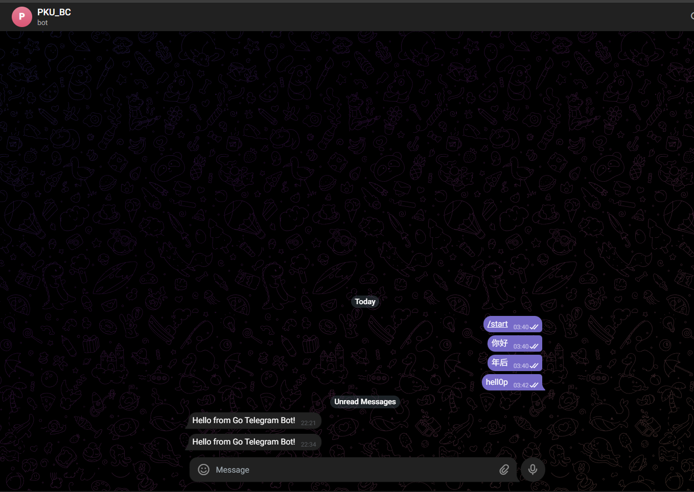

> 请在上边的 timezone 添加你的当地时区(UTC)，这会有助于你的打卡状态的自动化更新，如果没有添加，默认为北京时间 UTC+8 时区

[toc]

# LuBryant

1. 自我介绍：Hello~我叫卢博文，是北大物院25级的博士，现在刚刚开始接触区块链，希望可以多多学习到相关的知识。
2. 你认为你会完成这次共学小组吗？当然会的！
3. 你感兴趣的小组：Onchain-data
4. 你的微信号：18970447065
5. 质押的交易哈希：0xd9945efa0e52226f47de8b8937f34521fae5319271fdf004ab78a385f43847d9

## Notes

<!-- Content_START -->

### 2025.12.07
#### 学习计划和资料
刚刚学可以看一些入门视频：
- [WEB3新人公开课——PKU BLOCKCHAIN DAO - PKU学生区块链中心](https://space.bilibili.com/586660955/lists/894352?type=season)
- [WEB3进阶公开课——PKU BLOCKCHAIN DAO - PKU学生区块链中心](https://space.bilibili.com/586660955/lists/4309697?type=season)
- [从0到1到∞：14讲学懂区块链 - BTCU高校区块链社区](https://space.bilibili.com/477534964/lists/864223?type=series)
- [区块链/web3/加密货币](https://space.bilibili.com/1122798707/lists/5206919?type=season)
- [CS 251: Blockchain Technologies - Stanford University 2025](https://cs251.stanford.edu/) Only videos in 2019 are avilable.
- https://www.youtube.com/watch?v=Ud3r6GV8_Jw
- https://online.stanford.edu/courses/cs251-cryptocurrencies-and-blockchain-technologies
- https://gocanvas.stanford.edu/news/making-it-easier-students-shop-course-if-they-cant-come-class
- [Bitcoin and Cryptocurrency Technologies - Princeton 2015](https://www.coursera.org/learn/cryptocurrency/course-inbox)
- [Berkeley RDI - The Berkeley Center for Responsible, Decentralized Intelligence](https://rdi.berkeley.edu/)
- [Decentralized Finance - Berkeley RDI](https://rdi.berkeley.edu/berkeley-defi/f25)

#### Github 上复制文件
方法一：使用 GitHub Web Editor（最推荐，快捷键 .）
这是最接近本地操作体验的方法。GitHub 内置了一个基于 VS Code 的网页编辑器。

1. 打开你的 GitHub 仓库主页。
2. 在键盘上直接按下 英文句号键 .（或者将浏览器地址栏中的 github.com 改为 github.dev）。
3. 这会打开一个网页版的 VS Code 编辑器。
4. 在左侧文件树中，右键点击你要复制的文件 -> Copy。
5. 右键点击目标文件夹 -> Paste。
6. 点击左侧的“源代码管理”图标（Git 图标），输入 Commit 信息并提交更改。

方法二：手动“复制内容 + 新建文件”（适合单个小文件）
如果你不想进入编辑器模式，可以使用传统的笨办法：

1. 打开你想复制的文件。
2. 点击右上角的 Copy raw contents 图标（两个重叠的小方块）或者点击 Raw 按钮然后全选复制。
3. 回到仓库首页或目标文件夹。
4. 点击 Add file -> Create new file。
5. 在文件名处输入路径（例如 new_folder/filename.py）并粘贴内容。
6. 提交更改（Commit changes）。

#### Github 使用小知识

**如何知道自己有使用权限？**
方法一：最直观的 UI 验证（看“Settings”标签）
这是最简单的方法，不需要写代码。

1. 在浏览器中打开 你朋友的那个仓库页面（注意：不是你 Fork 出来的那个，是原本的那个 URL）。
2. 看页面顶部的导航栏（Code, Issues, Pull requests 那一行）。
3. 关键点： 如果你能看到 Settings（设置） 这一项，说明你已经是协作者了，拥有写权限。普通路人是看不到别人仓库的 Settings 选项的。

方法三：硬核命令行验证（Dry Run）
如果你已经把代码 clone 到本地了，可以用 Git 命令来测试。

注意： 因为你之前是 Fork 的，所以你本地默认的 origin 应该是指向 你自己的仓库。你需要先确认你有没有把你朋友的仓库添加为远程仓库（通常命名为 upstream，也可以取别的名字）。

请在终端执行以下步骤：

添加朋友的仓库作为远程地址（如果你还没加的话）：

```Bash
# 假设你朋友的仓库地址是 https://github.com/friend/project.git
git remote add upstream https://github.com/friend/project.git
```
测试推送权限（伪推送）： 使用 --dry-run 参数，这会模拟推送过程但不会真的把代码传上去，专门用来测试连接和权限。
```Bash
git push upstream main --dry-run
```
如果成功： 会显示 Everything up-to-date 或者模拟写入的信息。说明你有权限！

如果失败： 会显示 403 Forbidden 或者 Permission denied。

---

Fork 了项目只是自己有了一份，并不会修改原有仓库。

既然你已经在自己的 Fork 里提交了代码，现在要把这个改动“发送”给你的朋友。因为你是在网页端操作，最简单的方法就是 提 Pull Request (PR)。

虽然你有写权限，但 **跨仓库（从你的 Fork 到他的 Upstream）** 传输代码，在网页上只能通过 PR。

操作步骤：

1. 打开 你自己 的那个仓库页面（你能看到 Commit 的那个页面）。
2. 点击页面上方的 Pull requests 标签。
3. 点击绿色的 New pull request 按钮。
4. 关键检查：
    - 左边（Base repository）：应该是 你朋友的仓库 (main 分支)。
    - 右边（Head repository）：应该是 你的仓库 (main 分支)。
5. 你会看到两个仓库的差异（也就是你刚才修改的内容）。
6. 点击 Create pull request。

重点来了： 因为你有 写权限，当你创建完 PR 后，你会发现 Merge 按钮是绿色的（或者你可以直接去他的仓库里点 Merge）。你自己就可以批准并合并这个 PR，不需要等他操作。合并后，他的仓库就有了你的更新。

**下次如何直接利用“权限”修改？（不走弯路）**
如果你想利用他对你开放的权限，跳过 Fork 和 PR 的步骤，直接修改他的项目，你需要改变操作习惯：

场景 A：如果你坚持在网页上改
不要去你自己的仓库！

1. 直接在浏览器打开 你朋友的仓库 URL。
2. 找到那个文件。
3. 点击右上角的笔形图标（Edit）。
4. 修改完直接 Commit。
    - 注意：如果你的权限没问题，它会允许你直接 Commit to main branch。如果只能 Create a new branch，说明主分支被保护了，还是得走 PR。

场景 B：如果你在本地电脑（推荐，更有高手风范）
你需要告诉你的本地 Git，要把代码推送到哪里。

1. 在本地终端，把 你朋友的仓库 添加为一个新的远程地址（通常叫 upstream）
```Bash
git remote add upstream https://github.com/朋友ID/项目名.git
```
下次修改完代码，直接推送到他的仓库：

```Bash
git push upstream main
```

#### Week1 Part I - 动手部署一个智能合约
PKUBlockchain 25 Fall Get Ready Quest: https://github.com/aliceyzhsu/crypto-techguy/blob/main/quests/get-ready.md

🌟 手把手带你部署第一个智能合约！🚀

无论你是刚刚入门，还是已经对链上交易有所了解，这次教程都将带你完整走一遍在 Ethereum Sepolia 测试网部署智能合约的全过程。别担心，参考我们 5 分钟的视频教程, 全过程记录 https://drive.google.com/file/d/1KR5z9tDojekU1tELceUtHj3HwMlQxFRb/view?usp=drive_link

🎯 目标：在 Ethereum Sepolia 测试网上部署一个属于你自己的智能合约，并与该合约交互。


📌 准备工作：
1️⃣ 安装并配置好 MetaMask 钱包

2️⃣ 领取 Sepolia 测试网 ETH 测试币：https://cloud.google.com/application/web3/faucet/ethereum/sepolia 可以输入 ETH 的 address

3️⃣ 准备好你要部署的合约代码, 可以直接使用下面的例子:

```solidity
// SPDX-License-Identifier: MIT
// 指定编译器版本要求，0.8.0 及以上版本，但低于 0.9.0
pragma solidity ^0.8.0;

// 定义一个名为 HelloWeb3 的合约
contract HelloWeb3 {

    /* 定义一个事件 Greeting，当调用 hello 函数时触发，用来在链上日志中记录“Greeting”发生时的发送者地址和时间戳。
    indexed 让 sender 变成可检索字段，前端/后端可以按地址过滤日志。这个 event 可以在区块链浏览器中看到。
    unit256是 Solidity 里的无符号整数类型（unsigned integer）。
    uint = unsigned integer（只能是 0 或正数，不能是负数）
    256 = 位数，表示它占 256 bits = 32 bytes
    取值范围是：0 到 2^256 - 1
    */
    event Greeting(address indexed sender, uint256 timestamp);
    
    // 合约的构造函数，在合约部署时执行一次，这里不做任何操作
    constructor() {}

    // 定义一个外部可调用的函数 hello
    function hello() external {
        /* 
        当有人调用 hello() 时，发出 Greeting 事件，内容包括：
        msg.sender：调用者地址。
        block.timestamp：当前区块时间戳（由出块者提供，通常接近当前时间，但可能有小偏差）。
        */
        emit Greeting(msg.sender, block.timestamp);
    }
}
```


🔄 操作流程详解：

1. 打开 Remix IDE：[https://remix.ethereum.org](https://remix.ethereum.org/)
2. 新建 HelloWeb3.sol 文件，粘贴上述代码
3. 进入 Solidity Compiler 标签页，点击“Compile”
4. 进入 Deploy & Run Transactions 标签页
5. 确认 MetaMask 已切换至 Sepolia 网络（在代币下方可以切换网络
6. 环境选择 “Injected Provider - MetaMask” （Injected Provider 表示 Metamask 是哪条链，就是哪个，也可以直接选用 Sepolia Testnet - MetaMask）
7. 右上角的网络，确保连接到了 remix
8. Estimated Gas 可以自己选（估算的是这笔“部署交易”大概会用掉多少 gas，然后把这个数（通常会再加一点余量）作为 gasLimit 填进交易里。它不是价格，后面在 Metamask 上会显示 预估手续费
9. Verify Contract on Explorers 可以勾上
10. 点击 Deploy，在 MetaMask 中确认交易
11. 等待部署成功，在 Remix 控制台复制合约地址和交易哈希
12. Remix 中，部署的合约会出现在左下角 Deployed Contracts 区域，记录的交易会在 Transactions recorded 区域显示
13. 展开 Deployed Contracts，会看到部署的合约，后面跟着 contract address 合约地址。
14. 在已经部署的合约中调用 hello 函数，点击 hello 按钮即可，因为 hello 函数是没有参数的。
15. 签名后，交易成功，复制交易的 contract address
16. 打开[sepolia 的区块链浏览器](https://sepolia.etherscan.io/)，搜索部署的合约地址，查看 Transactions 和 Events 结果。（Etherscan 就是以太坊的"公开账本查询网站"，所有链上交易、合约、地址信息都能在上面查到。为什么叫"浏览器"？因为区块链上所有数据都是公开的，Etherscan 就像一个"搜索引擎 + 展示界面"，让你能方便地浏览这些链上数据，而不用自己跑节点、写代码去查。）

下面进行实际操作：
编译完成：

<p align="center">
    
</p>

编译完成后部署。合约需要一个 Owner，要进行签名


部署成功

```Bash
[block:9857972 txIndex:12]from: 0x5b9...dbA5Ato: HelloWeb3.(constructor)value: 0 weidata: 0x608...f0033logs: 0hash: 0x49d...51645
status	1 Transaction mined and execution succeed
transaction hash	0xb8cf5bb873c9e245c87c14b170084e6f3ec4879fbb99ab79481f6dd7230083de
block hash	0x49d764af04b14e744c024d8bec7a47adf4af5198733652bf65b0fe9a9ca51645
block number	9857972
contract address	0xF431B5677C341B7CE90C1ae9AD41E90de491125E
from	0x5b9e8d003C1D96D258E22B47cD00b8ac673dbA5A
to	HelloWeb3.(constructor)
transaction cost	102529 gas 
decoded input	{}
decoded output	 - 
logs	[]
raw logs	[]
```

成功部署之后，就可以调用 hello 函数，调用后需要签名

<p align="center">
    
</p>

交易成功
```Bash
[block:9858274 txIndex:16]from: 0x5b9...dbA5Ato: HelloWeb3.hello() 0xF43...1125Evalue: 0 weidata: 0x19f...f1d21logs: 1hash: 0x696...b4c86
status	1 Transaction mined and execution succeed
transaction hash	0xe068c7ffd29a6d0dc2f104c53c6f581229bb0863f19463024af41efd2bb90575
block hash	0x696ef3145e54589f1b927a875fc7f0b083de06ec4e965784bc7d536f3f6b4c86
block number	9858274
from	0x5b9e8d003C1D96D258E22B47cD00b8ac673dbA5A
to	HelloWeb3.hello() 0xF431B5677C341B7CE90C1ae9AD41E90de491125E
transaction cost	22755 gas 
decoded input	{}
decoded output	 - 
logs	[
	{
		"from": "0xF431B5677C341B7CE90C1ae9AD41E90de491125E",
		"topic": "0xd3c5e74ab50b58334f02e7b17dde164cce30984a5d60289c73a1c72e44898518",
		"event": "Greeting",
		"args": {
			"0": "0x5b9e8d003C1D96D258E22B47cD00b8ac673dbA5A",
			"1": "1765955232"
		}
	}
]
raw logs	[
  {
    "_type": "log",
    "address": "0xF431B5677C341B7CE90C1ae9AD41E90de491125E",
    "blockHash": "0x696ef3145e54589f1b927a875fc7f0b083de06ec4e965784bc7d536f3f6b4c86",
    "blockNumber": 9858274,
    "data": "0x00000000000000000000000000000000000000000000000000000000694256a0",
    "index": 35,
    "topics": [
      "0xd3c5e74ab50b58334f02e7b17dde164cce30984a5d60289c73a1c72e44898518",
      "0x0000000000000000000000005b9e8d003c1d96d258e22b47cd00b8ac673dba5a"
    ],
    "transactionHash": "0xe068c7ffd29a6d0dc2f104c53c6f581229bb0863f19463024af41efd2bb90575",
    "transactionIndex": 16
  }
]
```

找到合约地址（Contract address），打开区块链浏览器：https://sepolia.etherscan.io/，输入 Contract address

部署成功，Events 中显示 Greeting
<p align="center">
    
</p>

现在任何人都可以和这个 Contract address 交互。

---

### 2025.12.12

#### Week 1 Part II - 智能合约编写
##### 目标

通过编写智能合约与靶子合约交互，获取 Flag 并触发 `ChallengeCompleted` 事件。

##### 靶子合约信息

合约地址：`0x4a6C0c0dc8bD8276b65956c9978ef941C3550A1B`

所在网络: Ethereum Sepolia, https://chainlist.org/chain/11155111, 浏览器 https://sepolia.etherscan.io/

可用方法

- `hint()` - 获取解题提示
- `query(bytes32 _hash)` - 提交答案获取 Flag, 该方法只能通过合约调用
- `getSolvers()` - 查看所有完成者地址

##### 参考步骤

1. 编写并部署一个智能合约来调用靶子合约的 `hint()` 方法获取解题提示
2. 根据解题提示计算答案
3. 调用靶子合约的 `query()` 方法提交答案, 若答案正确, 则能够看到返回的 Flag 或者 ChallengeCompleted 事件

##### 注意事项

- 靶子合约要求调用者必须是合约地址，不能直接用钱包调用
- 可以多次尝试，每次成功都会触发事件
- 与合约交互需要消耗 Gas Fee, 可以参考笔试文档来获取测试网代币 https://github.com/aliceyzhsu/crypto-techguy/blob/main/quests/get-ready.md

##### 参考资料

- [Solidity 官方文档](https://docs.soliditylang.org/), [WTF 中文 Solidity 教程](https://www.wtf.academy/zh/course/solidity101)
- [Foundry 教程](https://book.getfoundry.sh/), Foundry 是一个工具集, 包含智能合约的构建/部署/调试等功能
- [Remix IDE](https://remix.ethereum.org/), Remix 是一个在线 IDE, 能够直接在网页上编写/部署/测试智能合约, 并且可以使用浏览器插件的钱包来签名
- (欢迎任何同学补充自己学习时用到的资料)

**使用代码**
```solidity
// SPDX-License-Identifier: MIT
// ↑ 这是许可证声明（License Identifier）
// Solidity 0.6+ 推荐在文件开头写这个，告诉别人这份代码用什么开源协议。
// MIT 表示很宽松：别人可以自由使用、修改、分发。

pragma solidity ^0.8.0;
// ↑ pragma 是“编译器版本要求”。
// 这行意思是：
// - 必须使用 Solidity 0.8.0 或更高版本编译
// - 但不能跨到 0.9.x（因为 ^0.8.0 的含义是 >=0.8.0 且 <0.9.0）
// 这样可以避免你用旧版本/不兼容版本导致行为不同或编译失败。


// ==========================================================
// 1) 定义靶子合约的接口 Interface
// ==========================================================
//
// 你现在写的是“Solver 合约”，它要去调用链上某个“靶子合约 target”。
// 但是你可能没有靶子合约的源代码（CTF 常见）。
//
// 这时候我们可以写一个 Interface（接口），只声明：
// “我知道靶子合约里有这些函数，它们的名字、参数、返回值长什么样”
//
// 注意：Interface 里只有函数声明，没有函数实现。
// Interface 作用就是：让编译器知道如何和对方合约“对接”。
interface ITarget {

    // function hint() external view returns (string memory);
    //
    // 逐个解释：
    // - function hint()：函数名叫 hint，没有参数
    // - external：只能从“外部”调用（比如其他合约、用户交易调用）
    //            外部合约调用时常用 external，gas 一般更省。
    // - view：表示这个函数不会修改链上状态（不会写入 storage），只是读取数据
    // - returns (string memory)：返回一个 string 字符串，它存放在 memory（临时内存）
    //   * memory：函数执行期间临时存在，执行结束就释放
    function hint() external view returns (string memory);

    // function query(bytes32 _hash) external;
    //
    // - query：函数名 query
    // - 参数 bytes32 _hash：一个 32 字节的数据（固定长度），常见用于哈希值
    // - external：外部调用
    // - 没写 returns：说明不返回任何值
    function query(bytes32 _hash) external;
}


// ==========================================================
// 2) Solver 合约：真正部署出来用来“解题”的合约
// ==========================================================
contract Solver {

    // ------------------------------------------------------
    // 靶子合约地址 targetAddress
    // ------------------------------------------------------
    //
    // address 是以太坊地址类型（20 字节）。
    // public：自动生成一个 getter 函数，让别人可以读取这个变量。
    //
    // 这里直接写死一个地址：
    // 0x4a6C...0A1B 代表链上已经部署好的靶子合约位置。
    //
    // 注意：如果你在别的网络（比如换到另一个测试网）这个地址可能不对。
    address public targetAddress = 0x4a6C0c0dc8bD8276b65956c9978ef941C3550A1B;


    // ======================================================
    // 步骤 A：获取提示 getHint()
    // ======================================================
    //
    // 这个函数只是“辅助用”，方便你在 Remix 点一下就能看到 hint 的字符串。
    //
    // public：谁都能调用（你自己、别人、其他合约都行）
    // view：不改状态，只读
    // returns (string memory)：返回提示字符串
    function getHint() public view returns (string memory) {

        // ITarget(targetAddress)
        // ↑ 这一步叫“类型转换/接口绑定”：
        //   你把一个 address 当成 ITarget 接口类型来用，
        //   让编译器相信：这个地址上的合约，确实有 hint() 和 query() 这些函数。
        //
        // .hint()
        // ↑ 调用靶子合约的 hint() 函数。
        //
        // 最终返回 hint() 的字符串结果。
        return ITarget(targetAddress).hint();
    }


    // ======================================================
    // 步骤 B：提交答案 solve(string memory solution)
    // ======================================================
    //
    // CTF 题常见逻辑是：
    // 你要提交一个字符串答案，但靶子合约不让你直接交字符串，
    // 而是要求你提交答案的 keccak256 哈希（bytes32）。
    //
    // 这个函数就是：你给我一个 solution 字符串，我帮你算 hash，然后交给靶子 query().
    //
    // 注意：这个函数不是 view，因为它会“调用靶子合约”，
    // 靶子合约的 query() 很可能会修改状态（比如记录你是否通过）。
    function solve(string memory solution) public {

        // --------------------------------------------------
        // 1) 把字符串 solution 变成 bytes，然后做 keccak256
        // --------------------------------------------------
        //
        // keccak256(...) 会返回 bytes32（32 字节哈希值）
        //
        // abi.encodePacked(solution)
        // ↑ 把参数紧密打包成字节序列（bytes）
        //   - “Packed” 代表紧凑编码，常用于算哈希
        //   - 注意：如果你传多个参数，encodePacked 可能会有“拼接歧义”
        //     （初学先记住：单个字符串一般没问题）
        //
        // 最终得到 answerHash：答案的哈希值
        bytes32 answerHash = keccak256(abi.encodePacked(solution));

        // --------------------------------------------------
        // 2) 调用靶子合约的 query(answerHash)
        // --------------------------------------------------
        //
        // ITarget(targetAddress).query(answerHash)
        // 表示：把 targetAddress 当成 ITarget 接口，调用它的 query 函数。
        //
        // 这里会发起一次“外部合约调用”，
        // 如果靶子合约内部逻辑要求正确 hash 才通过，那就看你算得对不对。
        ITarget(targetAddress).query(answerHash);
    }


    // ======================================================
    // 备用函数：solveRaw(bytes32 _hash)
    // ======================================================
    //
    // 有时候你可能在链下（比如用网站/脚本）已经把 hash 算好了，
    // 直接得到一个 bytes32。
    //
    // 那你就不用传字符串了，直接传 hash 更省事。
    function solveRaw(bytes32 _hash) public {
        // 直接把你给的 _hash 提交给靶子 query()
        ITarget(targetAddress).query(_hash);
    }
}
```
在部署的时候，CONTRACT 要选择 Solver - Solver.sol

第二步：部署攻击合约
在 Remix 左侧点击 Solidity Compiler (以及图标)，点击 Compile Solver.sol。

点击左侧 Deploy & Run Transactions (以太坊图标)。

Environment 选择 Injected Provider - MetaMask (这会连接你的钱包)。

确保 Contract 选中的是 Solver。

点击 Deploy 按钮，在 MetaMask 中确认交易。

等待交易成功，左下角 "Deployed Contracts" 会出现你的合约。

第三步：获取提示 (Get Hint)
展开你刚部署的合约。

点击 getHint 按钮。

查看返回的字符串内容（Result）。

假设提示是 "Hello"，或者是某个具体的单词/短语。

注意：有时候提示本身就是一个谜题，你需要根据提示算出真正的答案字符串。

这是一个非常经典的 CTF（Capture The Flag）智能合约挑战任务。你需要充当一名“攻击者”，编写一个中间合约去调用靶子合约。

由于题目明确指出 query() 方法只能通过合约调用（通常是通过 msg.sender != tx.origin 来限制的），所以你不能直接在 Etherscan 上操作，必须写代码。

结果：
```
0: string: keccak PKUBlockchain
```

这句话的意思是：“请对字符串 PKUBlockchain 进行 keccak256 哈希运算，并将结果提交上来。”

keccak: 指的是哈希算法 keccak256 (以太坊的标准哈希算法)。

PKUBlockchain: 指的是你需要进行哈希的原始内容（原文）。

进入在线网站：https://emn178.github.io/online-tools/keccak_256.html

得到 `PKUBlockchain` 的哈希值为 `e2a73c8e3af6379fa58e477b0e2129f21e0230100f0462b9832b00cd22414215`

成功完成任务。

**新的代码**
```solidity
// SPDX-License-Identifier: MIT
pragma solidity ^0.8.20;

/**
 * @title Sepolia CTF Solver (Generic)
 * @notice
 *  目标：通过“合约调用”的方式与靶子合约交互：
 *    1) 调 hint() 读取提示
 *    2) 根据提示计算答案（通常是 keccak256 哈希）
 *    3) 调 query(bytes32) 提交答案哈希，触发靶子合约的 ChallengeCompleted 事件/返回 Flag
 *
 *  关键点：
 *    - 靶子合约 query() 限制“只能被合约调用”，所以我们必须从合约里去 call 它。
 *    - 由于你没有提供靶子合约 ABI/源码，本合约用 low-level call：
 *        - hint() 用 staticcall（只读）
 *        - query(bytes32) 用 call（可能改变靶子合约状态）
 *    - 返回值类型不确定时，先拿到 raw bytes，再选择 decode 成 string / bytes32 / address[]
 */
contract SepoliaFlagSolver {
    // ======== 0. 靶子合约地址（你题目里给的） ========
    address public constant TARGET =
        0x4a6C0c0dc8bD8276b65956c9978ef941C3550A1B;

    // ======== 1. 访问控制：只允许部署者操作（避免别人盗用你的 solver） ========
    address public immutable owner;

    modifier onlyOwner() {
        require(msg.sender == owner, "Only owner");
        _;
    }

    constructor() {
        owner = msg.sender;
    }

    // ======== 2. 事件：把关键数据打到日志里，方便你在区块浏览器里直接看 ========

    /// @notice 把 hint() 返回的 raw 数据记录下来；如果能猜测出 string/bytes32 也一并记
    event HintFetched(bytes raw, string decodedString, bytes32 decodedBytes32);

    /// @notice 把 query() 返回的 raw 数据记录下来；如果能 decode 成 string/bytes32 也记
    event QuerySubmitted(bytes32 submittedHash, bytes rawReturn, string decodedString, bytes32 decodedBytes32);

    /// @notice 可选：把 getSolvers() 的解码结果打出来
    event SolversFetched(address[] solvers);

    // ======== 3. 读取 hint()：先拿 raw bytes，再“智能猜测”解码 ========

    /**
     * @notice 调用靶子合约 hint()，返回 ABI 编码后的 raw bytes
     * @dev
     *  staticcall：EVM 层面强制“不可写状态”，适合 view/pure 类函数。
     *  这里不假设 hint() 的返回类型，先直接拿回 data。
     */
    function hintRaw() public view returns (bytes memory data) {
        // 目标函数签名：hint()
        bytes memory callData = abi.encodeWithSignature("hint()");

        (bool ok, bytes memory ret) = TARGET.staticcall(callData);
        require(ok, _revertMsg(ret));

        return ret;
    }

    /**
     * @notice 尝试把 hint() 的返回值“猜测性解码”为 string 或 bytes32，并发事件方便查看
     * @dev
     *  ABI 规则：
     *   - 如果返回 bytes32，ret.length 通常是 32
     *   - 如果返回 string（动态类型），ret.length 通常 >= 64（包含 offset/length/data）
     *  这只是经验规则：我们用它做“尽力猜测”，不保证 100%。
     */
    function fetchHint() external returns (bytes memory raw) {
        raw = hintRaw();

        string memory asString = "";
        bytes32 asB32 = bytes32(0);

        if (raw.length == 32) {
            // 很像 bytes32
            asB32 = abi.decode(raw, (bytes32));
        } else {
            // 先尝试当作 string 解码；如果不是 string，会 revert
            // 为了不让整个函数 revert，我们用 try/catch 包一层外部调用技巧：
            // 这里用内部函数 _decodeString 来隔离 revert。
            try this._decodeString(raw) returns (string memory s) {
                asString = s;
            } catch {
                // 忽略：说明不是 string 或数据不符合 string ABI 编码
            }
        }

        emit HintFetched(raw, asString, asB32);
    }

    /**
     * @notice 仅用于 try/catch 的 string 解码“隔离器”
     * @dev
     *  注意：try/catch 只能包“外部调用”，所以这里用 this._decodeString(...) 触发一次外部调用。
     */
    function _decodeString(bytes memory raw) external pure returns (string memory) {
        return abi.decode(raw, (string));
    }

    // ======== 4. 计算答案 hash 的工具函数（你根据 hint 选择用哪个） ========

    /**
     * @notice 最常见：对“明文答案字符串”做 keccak256
     * @dev
     *  keccak256 是 Solidity 内置哈希；bytes(s) 是 UTF-8 字节序列。
     *  等价写法：keccak256(abi.encodePacked(s))（对单个 string 时等价）
     */
    function hashString(string calldata answerPlain) public pure returns (bytes32) {
        return keccak256(bytes(answerPlain));
    }

    /**
     * @notice 对“任意 bytes”做 keccak256
     * @dev
     *  当 hint 要你拼接/编码某些字段后再 hash，就可以先在本合约里拼出 bytes，再走这个函数。
     */
    function hashBytes(bytes calldata blob) public pure returns (bytes32) {
        return keccak256(blob);
    }

    /**
     * @notice 典型 CTF 拼接法：keccak256(abi.encodePacked(a, b, c...))
     * @dev
     *  encodePacked 是“紧密编码”，更省字节，但如果混用动态类型可能产生“拼接歧义/碰撞风险”；
     *  如果 hint 没要求，一般更推荐 abi.encode(...)（带类型边界）。:contentReference[oaicite:2]{index=2}
     */
    function hashPacked(string calldata a, string calldata b, uint256 n) public pure returns (bytes32) {
        return keccak256(abi.encodePacked(a, b, n));
    }

    /**
     * @notice 更“安全”的结构化编码：keccak256(abi.encode(...))
     * @dev
     *  encode 会把每个参数按 ABI 规则 padding，类型边界明确，避免 packed 的拼接歧义。
     */
    function hashEncoded(string calldata a, string calldata b, uint256 n) public pure returns (bytes32) {
        return keccak256(abi.encode(a, b, n));
    }

    // ======== 5. 提交答案：必须从合约里调用 query(bytes32) ========

    /**
     * @notice 直接提交“答案 hash”（bytes32）给靶子合约的 query(bytes32)
     * @return rawReturn query() 的原始返回数据（可能是空，也可能是 ABI 编码的 string/bytes32）
     */
    function submitHash(bytes32 answerHash) public onlyOwner returns (bytes memory rawReturn) {
        // 目标函数签名：query(bytes32)
        bytes memory callData = abi.encodeWithSignature("query(bytes32)", answerHash);

        (bool ok, bytes memory ret) = TARGET.call(callData);
        require(ok, _revertMsg(ret));

        // 尝试猜测性解码返回值（有的题会直接 return flag string）
        string memory asString = "";
        bytes32 asB32 = bytes32(0);

        if (ret.length == 32) {
            asB32 = abi.decode(ret, (bytes32));
        } else if (ret.length >= 64) {
            try this._decodeString(ret) returns (string memory s) {
                asString = s;
            } catch {
                // ignore
            }
        }

        emit QuerySubmitted(answerHash, ret, asString, asB32);
        return ret;
    }

    /**
     * @notice 你也可以把“明文答案”直接传进来，让合约帮你 hash 再提交
     * @dev
     *  适合：hint 直接告诉你答案明文是什么（比如某个单词/短句/数字字符串）
     */
    function solveWithPlaintext(string calldata answerPlain) external onlyOwner returns (bytes memory rawReturn) {
        bytes32 h = hashString(answerPlain);
        return submitHash(h);
    }

    // ======== 6. 读取完成者列表：getSolvers() ========

    /**
     * @notice 调靶子合约 getSolvers()，并 decode 成 address[]
     * @dev
     *  如果靶子合约确实有 getSolvers() 且返回 address[]，这里就能直接拿到。
     */
    function getSolvers() external returns (address[] memory solvers) {
        bytes memory callData = abi.encodeWithSignature("getSolvers()");
        (bool ok, bytes memory ret) = TARGET.staticcall(callData);
        require(ok, _revertMsg(ret));

        solvers = abi.decode(ret, (address[]));
        emit SolversFetched(solvers);
    }

    // ======== 7. 低级调用失败时，尽量把 revert reason 还原出来 ========

    /**
     * @dev
     *  当 call/staticcall 失败时，EVM 会把 revert data 返回给你：
     *   - 如果是 Error(string)，格式是 4 字节 selector + ABI 编码 string
     *   - 如果是自定义 error 或空 revert，可能解析不出原因
     *  这里做“尽力解析”，解析不出就给一个兜底信息。
     */
    function _revertMsg(bytes memory revertData) internal pure returns (string memory) {
        if (revertData.length < 4) return "Call failed (no revert data)";

        // Error(string) 的 selector 是 0x08c379a0
        bytes4 selector;
        assembly {
            selector := mload(add(revertData, 32))
        }

        if (selector == 0x08c379a0 && revertData.length >= 68) {
            // 跳过 4 字节 selector，再按 string 解码
            bytes memory sliced = new bytes(revertData.length - 4);
            for (uint256 i = 0; i < sliced.length; i++) {
                sliced[i] = revertData[i + 4];
            }
            return abi.decode(sliced, (string));
        }

        return "Call failed (non-Error(string) revert)";
    }
}
```

1. 打开 Remix（浏览器版），新建 Solver.sol，粘贴上面代码
2. Solidity Compiler 选择 0.8.20+（或更高 0.8.x），点击 Compile
3. Deploy & Run：
   - Environment 选 Injected Provider - MetaMask
   - MetaMask 切到 Sepolia
   - 部署 SepoliaFlagSolver（你需要一点点 Sepolia 测试 ETH付 gas；这是测试网）。CONTRACT 选 SepoliaFlagSolver - Solver.sol，然后点击 `Deploy & Verify` 按钮
4. 部署后，先点调用：
   - fetchHint()：会触发 HintFetched(...) 事件（在 Remix 的 logs 里看）
     - 如果能解码成 string，你会直接看到提示文本
     - 如果是 bytes32，你会看到 decodedBytes32

5. 按 hint 的要求算答案：
   - 如果 hint 直接给“答案明文”，用 solveWithPlaintext("答案")
   - 如果 hint 要你 hash 某种拼接：
     - 你可以先用 hashPacked(...) / hashEncoded(...) 在链上算出 bytes32
     - 再把算出来的 bytes32 填进 submitHash(0x...)

6. 成功后：
   - 靶子合约应触发 ChallengeCompleted（在浏览器/Remix 交易日志里能看到）
   - 如果 query() 有 return flag，本合约会在 QuerySubmitted(...) 里尽力 decode 成 string 给你看

实际情况
1. 点击 `Deploy & Verify` 部署成功，在 `Deployed Contracts` 中可以看到按钮。
2. 点击 `fetchHint()`，显示
```Bash

[block:9830638 txIndex:4]from: 0x5b9...dbA5Ato: SepoliaFlagSolver.fetchHint() 0xb4f...35313value: 0 weidata: 0xacc...09c67logs: 1hash: 0xbdd...a5c4f
status	1 Transaction mined and execution succeed
transaction hash	0xc0c922946e69d95f0e2859f7633b211c7b5c70028ce255a317c3e2a2ac37ad34
block hash	0xbdd3e6ad55a3a0fc6ceedce9bbc1b4317d296e414343afbc3b714168af1a5c4f
block number	9830638
from	0x5b9e8d003C1D96D258E22B47cD00b8ac673dbA5A
to	SepoliaFlagSolver.fetchHint() 0xb4f91Dd760BebC50EAc129bE369114fc2CD35313
transaction cost	33702 gas 
decoded input	{}
decoded output	 - 
logs	[
	{
		"from": "0xb4f91Dd760BebC50EAc129bE369114fc2CD35313",
		"topic": "0x9ad59c52bdf90579028db124d8acf23a6fe0fca9ad05b1f452b37181b2391e5d",
		"event": "HintFetched",
		"args": {
			"0": "0x000000000000000000000000000000000000000000000000000000000000002000000000000000000000000000000000000000000000000000000000000000146b656363616b20504b55426c6f636b636861696e000000000000000000000000",
			"1": "keccak PKUBlockchain",
			"2": "0x0000000000000000000000000000000000000000000000000000000000000000"
		}
	}
]
raw logs	[
  {
    "_type": "log",
    "address": "0xb4f91Dd760BebC50EAc129bE369114fc2CD35313",
    "blockHash": "0xbdd3e6ad55a3a0fc6ceedce9bbc1b4317d296e414343afbc3b714168af1a5c4f",
    "blockNumber": 9830638,
    "data": "0x000000000000000000000000000000000000000000000000000000000000006000000000000000000000000000000000000000000000000000000000000000e000000000000000000000000000000000000000000000000000000000000000000000000000000000000000000000000000000000000000000000000000000060000000000000000000000000000000000000000000000000000000000000002000000000000000000000000000000000000000000000000000000000000000146b656363616b20504b55426c6f636b636861696e00000000000000000000000000000000000000000000000000000000000000000000000000000000000000146b656363616b20504b55426c6f636b636861696e000000000000000000000000",
    "index": 8,
    "topics": [
      "0x9ad59c52bdf90579028db124d8acf23a6fe0fca9ad05b1f452b37181b2391e5d"
    ],
    "transactionHash": "0xc0c922946e69d95f0e2859f7633b211c7b5c70028ce255a317c3e2a2ac37ad34",
    "transactionIndex": 4
  }
]
```
查看 logs，告诉我们 hint 是 `keccak PKUBlockchain`，其它的含义为
- 0 是“原始数据”（给你兜底用）
- 1 是“把原始数据当 string 解出来的可读提示”（你真正要看的）
- 2 是“如果它其实是 bytes32 时的解码结果”（这题没用到，所以是 0）


3. keccak 是哈希函数，进入网页：https://emn178.github.io/online-tools/keccak_256.html 。就可以得到 `PKUBlockchain` 的哈希值为 `e2a73c8e3af6379fa58e477b0e2129f21e0230100f0462b9832b00cd22414215`，这是一个 bytes32 值，32字节，也就是 256 位的哈希值，但是这有个问题，在 Solidity / Remix / Ethers.js 里，把它当 bytes32 传参时，通常必须加上 `0x` 前缀，变成 `0xe2a73c8e3af6379fa58e477b0e2129f21e0230100f0462b9832b00cd22414215`。
4. 提交答案
    - 直接调用`solveWithPlaintext()`，在 Deployed Contracts 里可以找个这个按钮，输入 `PKUBlockchain`，然后执行
    - 直接提交 hash：调用 `submitHash()`，输入哈希值 `0xe2a73c8e3af6379fa58e477b0e2129f21e0230100f0462b9832b00cd22414215`

    方案一得到
    ```Bash
    [block:9830677 txIndex:8]from: 0x5b9...dbA5Ato: SepoliaFlagSolver.submitHash(bytes32) 0xb4f...35313value: 0 weidata: 0x088...14215logs: 2hash: 0x50e...5cba0
    status	1 Transaction mined and execution succeed
    transaction hash	0x0acd7700f8954987b4bfbb29b3a746b8e5852f843ae57cdb90370121f3a2c53a
    block hash	0x50e6469264ec7e7043570e4f6f8952e20c4311a24208b44a934fe418a4e5cba0
    block number	9830677
    from	0x5b9e8d003C1D96D258E22B47cD00b8ac673dbA5A
    to	SepoliaFlagSolver.submitHash(bytes32) 0xb4f91Dd760BebC50EAc129bE369114fc2CD35313
    transaction cost	87756 gas 
    decoded input	{
        "bytes32 answerHash": "0xe2a73c8e3af6379fa58e477b0e2129f21e0230100f0462b9832b00cd22414215"
    }
    decoded output	 - 
    logs	[
        {
            "from": "0xb4f91Dd760BebC50EAc129bE369114fc2CD35313",
            "topic": "0x8266f14bb4709222ba71d57776157a134a777a642d80bd52029333fdfdc17b76",
            "event": "QuerySubmitted",
            "args": {
                "0": "0xe2a73c8e3af6379fa58e477b0e2129f21e0230100f0462b9832b00cd22414215",
                "1": "0x0000000000000000000000000000000000000000000000000000000000000020000000000000000000000000000000000000000000000000000000000000002a464c41477b504b555f426c6f636b636861696e5f436f6c6561726e5f5765656b315f537563636573737d00000000000000000000000000000000000000000000",
                "2": "FLAG{PKU_Blockchain_Colearn_Week1_Success}",
                "3": "0x0000000000000000000000000000000000000000000000000000000000000000"
            }
        }
    ]
    raw logs	[
    {
        "_type": "log",
        "address": "0x4a6C0c0dc8bD8276b65956c9978ef941C3550A1B",
        "blockHash": "0x50e6469264ec7e7043570e4f6f8952e20c4311a24208b44a934fe418a4e5cba0",
        "blockNumber": 9830677,
        "data": "0x00000000000000000000000000000000000000000000000000000000693d35fc",
        "index": 17,
        "topics": [
        "0x57213678a1941131f1846559e4f0509e68d1a52c4d05bf0c3e8514c7a00b5d0b",
        "0x000000000000000000000000b4f91dd760bebc50eac129be369114fc2cd35313"
        ],
        "transactionHash": "0x0acd7700f8954987b4bfbb29b3a746b8e5852f843ae57cdb90370121f3a2c53a",
        "transactionIndex": 8
    },
    {
        "_type": "log",
        "address": "0xb4f91Dd760BebC50EAc129bE369114fc2CD35313",
        "blockHash": "0x50e6469264ec7e7043570e4f6f8952e20c4311a24208b44a934fe418a4e5cba0",
        "blockNumber": 9830677,
        "data": "0xe2a73c8e3af6379fa58e477b0e2129f21e0230100f0462b9832b00cd2241421500000000000000000000000000000000000000000000000000000000000000800000000000000000000000000000000000000000000000000000000000000120000000000000000000000000000000000000000000000000000000000000000000000000000000000000000000000000000000000000000000000000000000800000000000000000000000000000000000000000000000000000000000000020000000000000000000000000000000000000000000000000000000000000002a464c41477b504b555f426c6f636b636861696e5f436f6c6561726e5f5765656b315f537563636573737d00000000000000000000000000000000000000000000000000000000000000000000000000000000000000000000000000000000002a464c41477b504b555f426c6f636b636861696e5f436f6c6561726e5f5765656b315f537563636573737d00000000000000000000000000000000000000000000",
        "index": 18,
        "topics": [
        "0x8266f14bb4709222ba71d57776157a134a777a642d80bd52029333fdfdc17b76"
        ],
        "transactionHash": "0x0acd7700f8954987b4bfbb29b3a746b8e5852f843ae57cdb90370121f3a2c53a",
        "transactionIndex": 8
    }
    ]
    ```
    上面的 logs 里显示 `FLAG{PKU_Blockchain_Colearn_Week1_Success}` ，代表成功。
    方案二得到
    ```Bash
    [block:9831219 txIndex:18]from: 0x5b9...dbA5Ato: SepoliaFlagSolver.solveWithPlaintext(string) 0xb4f...35313value: 0 weidata: 0x9e4...00000logs: 2hash: 0x7b4...8e564
    status	1 Transaction mined and execution succeed
    transaction hash	0x78c07caf0dfba8a4f210d0db4279324a08a9fcf7cd8004f51808d2a9606318be
    block hash	0x7b47eac4d24823fe204791b02713ec340487a17487ee5e34f23692537848e564
    block number	9831219
    from	0x5b9e8d003C1D96D258E22B47cD00b8ac673dbA5A
    to	SepoliaFlagSolver.solveWithPlaintext(string) 0xb4f91Dd760BebC50EAc129bE369114fc2CD35313
    transaction cost	40845 gas 
    decoded input	{
        "string answerPlain": "PKUBlockchain"
    }
    decoded output	 - 
    logs	[
        {
            "from": "0xb4f91Dd760BebC50EAc129bE369114fc2CD35313",
            "topic": "0x8266f14bb4709222ba71d57776157a134a777a642d80bd52029333fdfdc17b76",
            "event": "QuerySubmitted",
            "args": {
                "0": "0xe2a73c8e3af6379fa58e477b0e2129f21e0230100f0462b9832b00cd22414215",
                "1": "0x0000000000000000000000000000000000000000000000000000000000000020000000000000000000000000000000000000000000000000000000000000002a464c41477b504b555f426c6f636b636861696e5f436f6c6561726e5f5765656b315f537563636573737d00000000000000000000000000000000000000000000",
                "2": "FLAG{PKU_Blockchain_Colearn_Week1_Success}",
                "3": "0x0000000000000000000000000000000000000000000000000000000000000000"
            }
        }
    ]
    raw logs	[
    {
        "_type": "log",
        "address": "0x4a6C0c0dc8bD8276b65956c9978ef941C3550A1B",
        "blockHash": "0x7b47eac4d24823fe204791b02713ec340487a17487ee5e34f23692537848e564",
        "blockNumber": 9831219,
        "data": "0x00000000000000000000000000000000000000000000000000000000693d4f64",
        "index": 123,
        "topics": [
        "0x57213678a1941131f1846559e4f0509e68d1a52c4d05bf0c3e8514c7a00b5d0b",
        "0x000000000000000000000000b4f91dd760bebc50eac129be369114fc2cd35313"
        ],
        "transactionHash": "0x78c07caf0dfba8a4f210d0db4279324a08a9fcf7cd8004f51808d2a9606318be",
        "transactionIndex": 18
    },
    {
        "_type": "log",
        "address": "0xb4f91Dd760BebC50EAc129bE369114fc2CD35313",
        "blockHash": "0x7b47eac4d24823fe204791b02713ec340487a17487ee5e34f23692537848e564",
        "blockNumber": 9831219,
        "data": "0xe2a73c8e3af6379fa58e477b0e2129f21e0230100f0462b9832b00cd2241421500000000000000000000000000000000000000000000000000000000000000800000000000000000000000000000000000000000000000000000000000000120000000000000000000000000000000000000000000000000000000000000000000000000000000000000000000000000000000000000000000000000000000800000000000000000000000000000000000000000000000000000000000000020000000000000000000000000000000000000000000000000000000000000002a464c41477b504b555f426c6f636b636861696e5f436f6c6561726e5f5765656b315f537563636573737d00000000000000000000000000000000000000000000000000000000000000000000000000000000000000000000000000000000002a464c41477b504b555f426c6f636b636861696e5f436f6c6561726e5f5765656b315f537563636573737d00000000000000000000000000000000000000000000",
        "index": 124,
        "topics": [
        "0x8266f14bb4709222ba71d57776157a134a777a642d80bd52029333fdfdc17b76"
        ],
        "transactionHash": "0x78c07caf0dfba8a4f210d0db4279324a08a9fcf7cd8004f51808d2a9606318be",
        "transactionIndex": 18
    }
    ]
    ```
    点击 `getSolvers`，可以看到完成者列表。
    ```Bash

    [block:9830706 txIndex:4]from: 0x5b9...dbA5Ato: SepoliaFlagSolver.getSolvers() 0xb4f...35313value: 0 weidata: 0x8bc...1e8eblogs: 1hash: 0xc1c...eba70
    status	1 Transaction mined and execution succeed
    transaction hash	0x4179351b392ad934c20f905c2ce171a811fe511a5054f16dc978d32f31606fd1
    block hash	0xc1c16dd1d6ebd3a8855adf7b0b0808e369c8c095e6e99b6524b6a9a11f8eba70
    block number	9830706
    from	0x5b9e8d003C1D96D258E22B47cD00b8ac673dbA5A
    to	SepoliaFlagSolver.getSolvers() 0xb4f91Dd760BebC50EAc129bE369114fc2CD35313
    transaction cost	235300 gas 
    decoded input	{}
    decoded output	 - 
    logs	[
        {
            "from": "0xb4f91Dd760BebC50EAc129bE369114fc2CD35313",
            "topic": "0x7b577cdd78df5a5866441b646f0193baede556ac9221461cd2e8060ff7279731",
            "event": "SolversFetched",
            "args": {
                "0": [
                    "0x218c49ac3F5ff91E7B4224dAAd7DdB1035D8c0F5",
                    "0xE80F519C246A2ed3B8d6B169C260389259d3E984",
                    "0x9e23a871543b160c13C8934bACe43B1D254C71bD",
                    "0x6F00A229cf51DB7Eec4B6996F2eBcFE365C0Ae98",
                    "0xCAc7f9d65914D7E03570Eb483E42D4Edf57c3A24",
                    "0xD72FE434FbC195b9f9977A946b9f947b3393D9Bd",
                    "0x42f7146F2fc178D0fe9C6877132e3f198b2CA261",
                    "0xa930B5059aE91C073684f0D2AFB0bBf5d84167C9",
                    "0x259fe967B55D20d04dB16858b4b0f648DdA21Eb1",
                    "0x27dc1B8C2A7686eB9e1867eAb5Cc72ECd0B244e8",
                    "0x123A03ec3979a1dbE9e91A0a1A809D0b2C7782bf",
                    "0xe81C686e6cEb2534f9703f5FF28640FA0fDFeEC1",
                    "0x8590C303374A00b58805318188a959059bD3332E",
                    "0x6faCCA1ff14bdfA04ccc3e19175432Dd2711b4c2",
                    "0x5DAB5b8600EaBB7450fCD084D9A377F280031297",
                    "0x0c3f07ee333489b2C5a257318C90273d1192B4b6",
                    "0xAACF85a258722f7C4A95635955c579469f1E7661",
                    "0xA98043AfD36bC184285951765C2833aaCDCF014C",
                    "0x4Ec3b4499223661c6932cB76952eB3c046a1Fd3A",
                    "0x27D3b992227976DF65e7a404ca7421f94ACBea7a",
                    "0xCc6FFE507ae55807E3b2CE5dffE36Fe14b9D2a8C",
                    "0xeC8aC4624E0CAfC8384BE140dD6a5b53f4CD5cE5",
                    "0xa0d8E9A7b81a78D0031acB47defd214A7b8eBFa8",
                    "0xb3c0aBfd2f6f47952e1Cf2B9cF8A8fDBF6651F3C",
                    "0x9Bd28675069f200961B50F13C476aDa5e7067C31",
                    "0xB5312cb94F72fC0b1e42CF8393Aa55F5C3658F2d",
                    "0xb4f91Dd760BebC50EAc129bE369114fc2CD35313"
                ]
            }
        }
    ]
    raw logs	[
    {
        "_type": "log",
        "address": "0xb4f91Dd760BebC50EAc129bE369114fc2CD35313",
        "blockHash": "0xc1c16dd1d6ebd3a8855adf7b0b0808e369c8c095e6e99b6524b6a9a11f8eba70",
        "blockNumber": 9830706,
        "data": "0x0000000000000000000000000000000000000000000000000000000000000020000000000000000000000000000000000000000000000000000000000000001b000000000000000000000000218c49ac3f5ff91e7b4224daad7ddb1035d8c0f5000000000000000000000000e80f519c246a2ed3b8d6b169c260389259d3e9840000000000000000000000009e23a871543b160c13c8934bace43b1d254c71bd0000000000000000000000006f00a229cf51db7eec4b6996f2ebcfe365c0ae98000000000000000000000000cac7f9d65914d7e03570eb483e42d4edf57c3a24000000000000000000000000d72fe434fbc195b9f9977a946b9f947b3393d9bd00000000000000000000000042f7146f2fc178d0fe9c6877132e3f198b2ca261000000000000000000000000a930b5059ae91c073684f0d2afb0bbf5d84167c9000000000000000000000000259fe967b55d20d04db16858b4b0f648dda21eb100000000000000000000000027dc1b8c2a7686eb9e1867eab5cc72ecd0b244e8000000000000000000000000123a03ec3979a1dbe9e91a0a1a809d0b2c7782bf000000000000000000000000e81c686e6ceb2534f9703f5ff28640fa0fdfeec10000000000000000000000008590c303374a00b58805318188a959059bd3332e0000000000000000000000006facca1ff14bdfa04ccc3e19175432dd2711b4c20000000000000000000000005dab5b8600eabb7450fcd084d9a377f2800312970000000000000000000000000c3f07ee333489b2c5a257318c90273d1192b4b6000000000000000000000000aacf85a258722f7c4a95635955c579469f1e7661000000000000000000000000a98043afd36bc184285951765c2833aacdcf014c0000000000000000000000004ec3b4499223661c6932cb76952eb3c046a1fd3a00000000000000000000000027d3b992227976df65e7a404ca7421f94acbea7a000000000000000000000000cc6ffe507ae55807e3b2ce5dffe36fe14b9d2a8c000000000000000000000000ec8ac4624e0cafc8384be140dd6a5b53f4cd5ce5000000000000000000000000a0d8e9a7b81a78d0031acb47defd214a7b8ebfa8000000000000000000000000b3c0abfd2f6f47952e1cf2b9cf8a8fdbf6651f3c0000000000000000000000009bd28675069f200961b50f13c476ada5e7067c31000000000000000000000000b5312cb94f72fc0b1e42cf8393aa55f5c3658f2d000000000000000000000000b4f91dd760bebc50eac129be369114fc2cd35313",
        "index": 4,
        "topics": [
        "0x7b577cdd78df5a5866441b646f0193baede556ac9221461cd2e8060ff7279731"
        ],
        "transactionHash": "0x4179351b392ad934c20f905c2ce171a811fe511a5054f16dc978d32f31606fd1",
        "transactionIndex": 4
    }
    ]
    ```

**如何看到 `ChallengeCompleted` 事件？**

ChallengeCompleted 是靶子合约发出来的事件，所以你要在“那笔交易的日志（logs）”里看。最稳的查看方式有 3 种：

方法 1：在 Etherscan 看（最推荐）

1. 你在 Remix 点 submitHash(...) 之后，底下 Terminal 会出现一行类似：
   - transaction hash: 0x...
2. 把这个 **交易哈希（0x 开头那串）** 复制出来
3. 打开 Sepolia Etherscan，把交易哈希粘进去搜索
4. 在交易页面往下找：
   - Logs / Transaction Receipt / Events（不同界面叫法略有差别）
5. 你会看到事件列表：
   - 你自己的合约事件（比如 QuerySubmitted）
   - 以及靶子合约的事件（如果 ABI 可识别，会直接显示 ChallengeCompleted；如果不识别，也会显示一条 log，只是名字不显示）

<p align="center">
    <image src="md_assets/LuBryant/image-1.png" alt="alt text"/>
</p>


方法 2：在 Remix 里看“交易日志”

1. Remix 里点完 transact 后，Terminal 会打印 “decoded output / logs”
2. 你一定能看到你解题合约自己的事件（QuerySubmitted、HintFetched）
3. 但靶子合约的 ChallengeCompleted 有时 Remix 不一定能自动解码成名字（因为 Remix 不知道靶子合约 ABI），可能只显示成一条原始 log（topic + data）
4. 所以：Remix 能看，但不一定直接显示 ChallengeCompleted 这个名字，Etherscan 更直观。

方法 3：用 getSolvers() 验证是否完成（旁证）

- 完成后，你的地址通常会出现在靶子合约的完成者列表里。
- 你可以在我给你的 Solver 合约里点：getSolvers()
- 看输出/事件 SolversFetched
- 或者直接在 Etherscan 靶子合约页面的 “Read Contract” 里调用 getSolvers()（如果有可读界面）


**合约地址是什么？**
为什么 getSolvers() 里没有你的钱包地址？

因为你是这样调用的：
- 你的钱包地址（EOA）：0x5b9e8d003C1D96D258E22B47cD00b8ac673dbA5A
- 你调用的是你自己部署的解题合约：SepoliaFlagSolver（地址 0xb4f91Dd760BebC50EAc129bE369114fc2CD35313）
- 然后解题合约再去调用靶子合约的 query(...)

对靶子合约来说，msg.sender 看到的不是你的钱包，而是你的解题合约地址。
所以靶子合约的 getSolvers() 很可能记录的是：✅ `0xb4f91Dd760BebC50EAc129bE369114fc2CD35313`（你的 Solver 合约地址），而不是你的钱包地址。

你在 raw logs 里也能直接验证这一点：靶子合约那条 log 的 topics[1] 就是 ...b4f91dd...35313（你的 Solver 合约）。这通常就是 ChallengeCompleted(address solver, ...) 这种“indexed solver”的参数。

> “解题合约地址”就是：你把那份 Solver.sol 部署到 Sepolia 之后，在链上生成的那个合约实例的地址（0x…）。它跟“靶子合约地址”是同一类东西——都是链上一个合约账户的地址。

在 Remix 里我怎么找到“解题合约地址”？
- 在 Remix 左侧 Deploy & Run Transactions 里：
- 你部署完合约后，会出现在 Deployed Contracts
- 合约名字旁边通常会显示/可展开看到一个 0x...，那就是你的解题合约地址


想看交易效果，也可以把靶子合约地址直接在 Etherscan 里打开 `0x4a6C0c0dc8bD8276b65956c9978ef941C3550A1B`
- 找 Contract → Read Contract
- 找到 getSolvers，点 Query
- 然后就可以看到所有的提交成功的 address

<p align="center">
    <image src="md_assets/LuBryant/image-2.png" alt="alt text"/>
</p>

---

### 2025.12.13

#### Week 3 使用 Geth 读取链上数据

本周目标：

- 学会用 Geth 的 Go 客户端从 RPC 节点读取链上信息
- 理解区块链底层数据结构（block、transaction、receipt）

这些是做 DApp、链上分析、合约调试等的基础。

#### Week 3 Part I - Geth 简介

首先了解了 Geth。The pronounce of Ethereum is "E-theer-ee-um", or like "uh·'theh·ree·uhm".
By IPA Keyboard: https://ipa.typeit.org/
/ə’θiriəm/
/I’θiriəm/

##### 背景：以太坊网络的运作方式

可以先把以太坊理解成一个由全球许多计算机共同维护的公共账本，没有中心服务器。要让这个系统正常运作，主要涉及三个概念：**以太坊客户端、节点、RPC**。

###### 1. 以太坊客户端：协议的具体实现

以太坊客户端是一类遵循以太坊协议的软件实现，比如 Geth、Nethermind、Erigon 等。它们负责：

- 按协议格式解析区块和交易
- 验证新区块是否合法
- 维护本地区块链状态（账户余额、合约存储等）
- 和其他节点进行 P2P 通信、同步数据

只有安装并运行这些客户端软件，电脑才能真正“加入”以太坊网络。

> 使用情景：  
> 你在电脑上安装并运行 Geth，实际上就是在运行一个以太坊客户端实例，它会开始从网络上同步区块，把本地变成一个以太坊节点。

###### 2. 节点：运行客户端的软件实例

“节点”指的是**运行了以太坊客户端程序的机器**。从功能和数据完整性角度，一般分为：

- **全节点（full node）**：保存当前完整状态和必要的历史数据，可以独立验证新区块和交易；
- **轻节点（light node）**：只保存少量数据和区块头，需要向其他节点请求详细信息；
- **归档节点（archive node）**：不仅保存当前状态，还保存所有历史状态，方便做历史查询和分析，但资源消耗很大。

节点之间通过 P2P 网络互连，互相转发新区块、交易，并进行验证，以保证网络整体的一致性和安全性。

> 使用情景： 你在钱包里发起一笔转账交易.
> 交易从钱包发出之后，会先发送给一个或多个节点，这些节点再向网络扩散。最终，有矿工/验证人节点把它打包进区块，你的交易才真正“上链”。

###### 3. RPC：给外部程序用的访问接口

RPC（Remote Procedure Call，远程过程调用）是节点向外暴露的一组标准接口，用来**让其他程序查询或提交数据**，常见是 HTTP RPC 或 WebSocket RPC。

通过 RPC，你可以：

- 查询账户余额、交易、区块等信息
- 调用合约的只读方法（`eth_call`）
- 广播一笔签名好的交易（`eth_sendRawTransaction`）

RPC 的好处是：你不需要在自己的程序里实现底层网络协议，只要按 JSON-RPC 的格式发 HTTP 请求即可。

> 使用情景：  
> 你写了一个区块浏览器网站，前端/后端服务不会直接跑一个全节点，而是通过 RPC 问某个节点：“给我某个区块的详细信息”、“给我这个账户的最近交易”。

---

##### Geth：最主流的以太坊客户端之一

Geth（Go Ethereum）是用 Go 语言实现的以太坊客户端，也是目前使用最广泛的实现之一。它主要包含两部分：

###### 1. 命令行程序 `geth`

安装 Geth 后，你会得到一个名为 `geth` 的命令行工具。运行它可以：

- 启动一个以太坊节点（全节点 / 轻节点等）
- 同步主网、测试网（如 Sepolia）的数据
- 管理本地账户（创建、导出、签名）
- 对外提供 HTTP / WebSocket RPC 接口

例如：

```bash
geth --sepolia --http --http.api eth,net,web3
```

这条命令会启动一个连到 Sepolia 测试网的节点，并在本地开一个 HTTP RPC 接口，供你或其他程序来查询链上数据。

> 使用情景：  
> 如果你要自己搭一个“私有的 RPC 节点”做数据分析，可以在一台云服务器上跑 `geth`，开 HTTP RPC，然后你的分析脚本就可以连这台服务器，而不是用公共 RPC。

###### 公共 RPC 节点 vs 私有 RPC 节点

从 Geth / 客户端库的视角看，区别就是你 `Dial` 的 URL 不同，但在权限和成本上差异很大：

- **公共 RPC**
  - 例子：Infura、Alchemy、公共的 Sepolia RPC 等；
  - 优点：不用自己同步链、配置简单，适合课程作业、demo、小工具；
  - 限制：有调用频率/配额限制，有些高成本接口可能被关掉，节点配置不可控。

- **私有 RPC**
  - 自己或团队运行的 Geth / 其他客户端节点，对外开 RPC；
  - 优点：可完全控制节点类型和配置、无第三方限流、访问模式不暴露给服务商；
  - 成本：要自己承担同步、存储和运维，适合长期运行的服务端、交易所、大规模数据分析等。

> 使用情景：  
> - 本课程 / 一般练习：直接连公共的 Sepolia RPC 即可，比如：`https://ethereum-sepolia-rpc.publicnode.com`。  
> - 需要扫主网大量历史数据、或做交易所钱包服务时，更倾向于自己起一个 Geth 节点，跑私有 RPC。

###### 2. Go 客户端库（`go-ethereum`）

除了命令行工具，Geth 还提供了一套 Go 客户端库，方便在 Go 代码里和以太坊交互。常用的是 `ethclient` 包：

```go
import (
    "context"

    "github.com/ethereum/go-ethereum/ethclient"
)

func main() {
    // 连接公共 RPC（默认用法）
    client, err := ethclient.Dial("https://ethereum-sepolia-rpc.publicnode.com")
    // 也可以换成你自己的私有 RPC 节点
    // client, err := ethclient.Dial("http://your-server-ip:8545")

    if err != nil {
        panic(err)
    }
    defer client.Close()

    // 后面可以用 client 查询区块、交易、余额等
}
```

在本周任务中，我们不自己运行 Geth 节点，而是侧重使用 **Go 客户端库 + 公共 Sepolia RPC** 来读取链上数据，并理解 block / transaction / receipt 的结构。
<br>

这个项目不需要安装 geth，只需要在项目里引入 go-ethereum 这个 Go 库（也就是 Geth 的 Go SDK）。

但是为了学习，我还是可以安装一下。

Official website: https://geth.ethereum.org 

Just download it and install it.

显示 `PATH not updated, original length 1842 > 1024`

这个报错常见原因是：一些 Windows 安装器用 NSIS 写的，更新 PATH 时有 字符串长度上限（1024），你的 PATH 已经 1842，所以它直接放弃更新。 

你要做的就是 手动把 geth.exe 所在文件夹加到 PATH（推荐加到“用户 Path”，不会影响全局）：

1. 找到 geth.exe 的安装目录（例如 C:\Program Files\Geth\ 或你自己选的目录）
2. Windows：开始菜单搜索 “环境变量” → 打开 “编辑系统环境变量”
3. 点 “环境变量…” → 在 用户变量 里选 Path → 编辑 → 新建 → 粘贴 geth 所在目录 → 一路确定
4. 关闭并重新打开 PowerShell/cmd，然后运行：
```shell
where geth
geth version
```
成功安装。

---

### 2025.12.17

#### Week 3 Part II - Go 语言环境准备

*本周需要用 Go 编写与节点交互的简单程序。本节只介绍完成本课所需的**最小知识**。*

Go（Golang）是 Google 开发的一门静态强类型语言，语法相对简洁，内置并发支持。Geth 本身就是用 Go 写的，因此官方提供的以太坊客户端库也是用 Go 实现的。你只需要会：

- 安装 Go 并能在命令行运行 `go`；
- 新建一个最简单的 Go 项目；
- 知道如何 `import` 其他库，并调用它们提供的函数。

关于 Go 的语法，可以参考：

+ A Tour of Go https://go.dev/tour/list
+ 中文版 https://tour.go-zh.org/list

##### 1. 安装 Go

官方下载：https://go.dev/dl/

按系统提示安装完成后，在命令行（PowerShell / cmd）检查：

```bash
go version
```

如果能看到版本号（例如 `go version go1.22.3 windows/amd64`），说明安装成功。

得到 `go version go1.25.5 windows/amd64`

> 小提示：  
> 后续所有 `go xxx` 命令都是在命令行里执行，而不是在 Go 源码文件里写。

##### 2. 新建项目

在你准备存放本周代码的目录下，新建一个文件夹并初始化 Go 模块：

```bash
mkdir week3-geth
cd week3-geth
go mod init week3-geth
```

`go mod init` 会创建一个 `go.mod` 文件，记录当前项目的模块名和依赖信息，后面 `go get` 的第三方库都会写进这里。

创建 `main.go`：

```go
package main

import "fmt"

func main() {
    fmt.Println("hello go")
}
```

运行：

```bash
go run main.go
```

如果能在命令行看到输出 `hello go`，说明你的 Go 环境和项目结构是正常的。

（运行的时候一直卡住，后面突然又好了）

> 你可以把后面所有示例代码都放在这个 `main.go` 里，逐步替换和扩展。

##### 3. 安装 go-ethereum 库

本课所有与以太坊交互的能力，都来自官方的 `go-ethereum` 库。我们用 `go get` 把它加入当前项目依赖：

```bash
go get github.com/ethereum/go-ethereum
```

执行完成后，你会在 `go.mod` / `go.sum` 里看到相应记录；在代码里就可以这样引用：

```go
import "github.com/ethereum/go-ethereum/ethclient"
```

> 中国大陆访问 go-ethereum 依赖失败，可设置 Go 代理：
> - **Windows (PowerShell)：**
>   ```powershell
>   $env:GOPROXY="https://goproxy.cn,direct" # 临时代理, 在同一终端会话生效
>   ```
> - **Linux/macOS (bash/zsh)：**
>   ```bash
>   export GOPROXY=https://goproxy.cn,direct # 临时代理, 在同一终端会话生效
>   ```
>   设置后重新执行 `go get` 命令即可。

本课用到的 Go 知识基本只有：

- `package main` / `func main()` 入口函数；
- `import` 引入标准库和第三方库；
- 基本的函数调用、错误处理（`if err != nil { ... }`）；
- 使用 `go-ethereum` 提供的类型和方法（例如 `ethclient.Dial`、`HeaderByNumber` 等）。

其余语法如果暂时不熟悉，可以边查边用，不影响完成本周任务。

#### Week 3 Part III - 使用 go-ethereum 读取链上数据

引入客户端：

```go
import "github.com/ethereum/go-ethereum/ethclient"
```

连接到 Sepolia RPC

```go
client, err := ethclient.Dial("https://ethereum-sepolia-rpc.publicnode.com")
if err != nil {
    panic(err)
}
```

获取当前区块高度

```go
header, err := client.HeaderByNumber(context.Background(), nil)
fmt.Println("current block:", header.Number.String())
```

查询区块

```go
blockNumber := big.NewInt(123456)
block, _ := client.BlockByNumber(context.Background(), blockNumber)

fmt.Println("hash:", block.Hash().Hex())
fmt.Println("parent:", block.ParentHash().Hex())
fmt.Println("tx count:", len(block.Transactions()))
```

查询交易与回执

```go
txHash := common.HexToHash("0x你的交易哈希")
tx, _, _ := client.TransactionByHash(context.Background(), txHash)

fmt.Println("to:", tx.To())
fmt.Println("value:", tx.Value().String())
```

Receipt：

```go
receipt, _ := client.TransactionReceipt(context.Background(), txHash)

fmt.Println("status:", receipt.Status)
fmt.Println("logs:", receipt.Logs)
```

合并到一起的一个样例，该样例仅打印了部分字段，建议同学们修改代码，打印出完整的结构: 

参考完整代码文件：[main.go](./week3-geth/main.go)

```go
package main

import (
	"context"
	"fmt"
	"log"
	"math/big" 
	// go 标准库

	"github.com/ethereum/go-ethereum/common"
	"github.com/ethereum/go-ethereum/ethclient" // 如果提示缺少依赖, 按照给出的报错信息安装即可，使用 go get
)

func main() {
	ctx := context.Background()

	client, err := ethclient.Dial("https://ethereum-sepolia-rpc.publicnode.com")
	if err != nil {
		log.Fatal(err)
	}
	defer client.Close()

	header, err := client.HeaderByNumber(ctx, nil)
	if err != nil {
		log.Fatal(err)
	}
	fmt.Printf("Current block: %s\n", header.Number.String())

	targetBlock := big.NewInt(123456)
	block, err := client.BlockByNumber(ctx, targetBlock)
	if err != nil {
		log.Fatal(err)
	}
	fmt.Printf("Block #%s hash: %s\n", block.Number().String(), block.Hash().Hex())
	fmt.Printf("Parent hash: %s\n", block.ParentHash().Hex())
	fmt.Printf("Tx count: %d\n", len(block.Transactions()))
//==========================
	txHash := common.HexToHash("0x903bd6b44ce5cfa9269d456d2e7a10e3d8a485281c1c46631ec8f79e48f7accb") //测试用交易hash, 你可以替换成任何你想查询的交易hash
//=========================
	tx, isPending, err := client.TransactionByHash(ctx, txHash)
	if err != nil {
		log.Fatal(err)
	}
	fmt.Printf("Tx pending: %t\n", isPending)
	if to := tx.To(); to != nil {
		fmt.Printf("To: %s\n", to.Hex())
	} else {
		fmt.Println("To: contract creation")
	}
	fmt.Printf("Value (wei): %s\n", tx.Value().String())

	receipt, err := client.TransactionReceipt(ctx, txHash)
	if err != nil {
		log.Fatal(err)
	}
	fmt.Printf("Receipt status: %d\n", receipt.Status)
	fmt.Printf("Logs: %d entries\n", len(receipt.Logs))
}
```

示例结果
```bash
Current block: 9750075
Block #123456 hash: 0x2056507046b07a5d7ed4f124a7febce2aec7295b464746523787b8c2acc627dc
Parent hash: 0x93bff867b68a2822ee7b6e0a4166cfdf5fc4782d60458fae1185de9b2ecdba16
Tx count: 0
Tx pending: false
To: 0x9Bd28675069f200961B50F13C476aDa5e7067C31
Value (wei): 0
Receipt status: 1
Logs: 2 entries
# 如果一切正常, 你将会得到类似于上面的输出结果
# 你可以修改代码打印任何你想查询的数据和数据结构
```

我的结果
```bash
Current block: 9854809
Block #123456 hash: 0x2056507046b07a5d7ed4f124a7febce2aec7295b464746523787b8c2acc627dc
Parent hash: 0x93bff867b68a2822ee7b6e0a4166cfdf5fc4782d60458fae1185de9b2ecdba16
Tx count: 0
Tx pending: false
To: 0x9Bd28675069f200961B50F13C476aDa5e7067C31
Value (wei): 0
Receipt status: 1
Logs: 2 entries
```

#### Week 3 Follow Up - 理解 block, transaction, receipt 的结构

上一节中查询到的数据会包含大量字段。本部分任务要求理解其中关键字段的含义。

关于 Block 建议理解的字段包括：

- 以太坊里一个 block 可以理解成：Header（头） + Body（体）
  - Header：描述这个区块“是谁、什么时候、接在谁后面、允许消耗多少 gas”等元信息
  - Body：主要就是 transactions（交易列表）以及叔块等（现在 PoS 语境下概念略变，但你用 go-ethereum 读到的结构仍是类似组织）
- number
  - 区块高度，从 0 开始递增。
  - 用它可以定位区块序列位置，但不具备抗篡改性（真正抗篡改靠 hash 链接）。
- hash
  - 区块头（header）内容哈希后的结果（简化理解即可）。
  - 只要 header 任一关键字段变化（如 timestamp、parentHash、stateRoot、transactionsRoot…），hash 就会变化。
- parent Hash
  - 上一个区块的 hash。
  - 客户端用它把区块连成“从创世块开始的一条链”。
- timestamp
  - 出块时间（Unix 时间戳）。
  - 注意它不是“绝对可信的墙钟时间”，协议只要求满足一些约束（例如必须大于父块时间戳等），所以更适合用作“链上时间近似”。
- gasUsed / gasLimit
  - gasLimit（区块级）：这个区块 最多允许消耗的总 gas 上限（所有交易的 gas 消耗加起来不能超过它）。
  - gasUsed（区块级）：这个区块 实际消耗的 gas 总量。
  - 直观理解：gasLimit 决定了一个区块最多能塞多少计算/多少交易，gasUsed 则是“实际塞了多少”。
- transactions
  - 区块中交易列表（每笔交易至少包含 from/to/value/data/gas/gasPrice 或 EIP-1559 字段等）。
  - 你这儿 Tx count: 0 表示该区块没有交易，所以“区块体”里交易数组为空。

Transaction（交易） vs Receipt（回执）
Transaction 常见关键字段（你输出里出现了 To、Value、pending 等）
- to：接收方地址
  - 若是 合约创建交易：to == nil（或显示为空），新合约地址会在 receipt 里给你（contractAddress）。
- value：转账 ETH 数量（单位 wei）。你这里 Value (wei): 0 表示这笔交易没有转 ETH（但仍可能在调用合约、写状态）。
- data：调用合约的 calldata（ABI 编码后）。
- gas（交易级上限）：发送方愿意为这笔交易最多提供多少 gas（注意这和区块的 gasLimit 不一样）。
- pending：是否还在 mempool 未被打包。你这里 Tx pending: false 表示已上链（或至少节点认为不在 pending 状态）。

Receipt（回执）关键字段（你输出里出现了 Receipt status、Logs）
- status：执行是否成功
  - 1 成功，0 失败（失败通常意味着 revert 或异常）。你这里 Receipt status: 1。
- logs：事件日志数组（合约 emit Event(...) 产生）
  - 你这里 Logs: 2 entries 表示这笔交易执行过程中发出了 2 条事件日志。
- 常见但你没打印的还有：gasUsed（交易实际消耗）、transactionIndex（在区块中的位置）、blockHash/blockNumber（所属区块）等。

Follow-Up：

- 为何 parent Hash 能形成区块链？
  - 核心原因：每个区块都把父区块的 hash “写死”在自己的 header 里。
  - 假设有链 ... -> B(n-1) -> B(n)，其中 B(n).parentHash = hash(B(n-1))
  - 如果有人想篡改 B(n-1) 的内容（比如改交易），那么 hash(B(n-1)) 会变化
  - 于是 B(n) 里记录的 parentHash 就不匹配了，链会断掉
  想让链重新接上，必须同时重写 B(n)、B(n+1)… 直到最新块，并且还要在共识规则下“赢过”诚实网络（PoW 时代是算力，PoS 时代是权益/最终性与验证者投票机制）
- gasLimit 如何影响合约执行
  - 交易级 gas 上限（tx.gas / gasLimit）：限制“这笔交易最多能花多少 gas”
    - 如果执行过程中 gas 不够，会 Out of Gas，状态回滚（但已消耗的 gas 仍会付费）。
    - 所以：交易发起者设得太小，合约再正确也可能跑不完。
  - 区块级 gasLimit（block.gasLimit）：限制“一个区块内所有交易加起来最多能消耗多少 gas”
    - 矿工/出块者在打包交易时，不能让总 gasUsed 超过这个上限。
    - 所以：区块 gasLimit 越高，理论上每个区块能容纳的计算越多，吞吐更高；但也会带来更大的区块验证/传播压力（网络与节点成本上升），所以它是性能与去中心化成本之间的权衡点。
  - 对“合约执行”最直接的影响是：
    - 单笔合约调用能否完整执行：主要看交易级 gas 上限是否足够。
    - 你的交易能否尽快被打包：还受区块级 gasLimit + 当前区块拥堵度 + 费用报价影响。
  


***

关于 Transcation 建议理解的字段包括：

- nonce
  - 账户已发送交易数；防重放和排序
- from / to
  - 发起方地址；to 为空或不存在时是创建合约交易，非空是调用/转账。
- input (call data)
  - 调用数据。转账通常为空；合约调用包含函数选择器和参数编码。
- gas / gasPrice
  - gas 是愿意消耗的上限；gasPrice（或 EIP-1559 下的 maxFeePerGas / maxPriorityFeePerGas）是每单位 gas 愿支付的价格。
- value
  - 随交易附带的 ETH 数量（wei）
- type (legacy, EIP-1559)
  - 0 为 legacy；2 为 EIP-1559（带 base fee + priority fee）；1 多用于访问列表 EIP-2930。

Follow-Up：

- 什么是 ABI ？一笔交易最终执行逻辑是如何解析 input 的
  - （Application Binary Interface）：定义合约函数、事件的签名与参数类型的规范，告诉外界如何编码/解码调用数据与日志。
  - 解析 input：前 4 字节是函数选择器（keccak256("funcName(argTypes)") 前 4 字节）；后续参数按 ABI 类型编码（定长/动态、偏移与长度）。节点或库（ethers.js、web3.js、viem 等）用 ABI 把选择器匹配到函数，再按 ABI 规则解码字节得到人类可读的参数，随后 EVM 执行对应函数逻辑。

***

关于 Receipt 建议理解的字段包括:

- status
  - 含义：交易执行的最终状态，是一个布尔值（或 0/1）
  - 解释：
    - 1 (Success): 交易执行成功，状态改变已生效。
    - 0 (Failure/Revert): 交易执行失败（例如 require 不满足、 Gas 不足等），所有状态变更（除了 Gas 消耗）全部回滚。
  - 重要性：判断交易是否“真正”完成的核心字段。（注意：交易上链不代表交易成功，必须看 Receipt 的 status）。
- logs
  - 含义：交易执行过程中触发的事件（Events）数组。
  - 解释：每个日志包含 address（发出事件的合约）、topics（索引主题，topic[0] 通常是事件签名的哈希）、data（非索引参数数据）。
  - 重要性：这是链上与链下（前端、indexer、The Graph）通信的主要方式。例如转账的 Transfer 事件、Swap 的 Swap 事件都在这里。
- contractAddress
  - 含义：如果该交易是“部署合约”交易（即 to 字段为空），此字段显示新部署合约的地址。
  - 解释：如果是普通调用交易，该字段通常为 null。
  - 计算方式：通常由 keccak256(rlp([sender, nonce])) 计算得出（对于 CREATE 操作）；如果是 CREATE2 操作，则与 salt 和 initCode 有关。

***

可供参考的资料包括但不限于，也可以自行检索：

+ https://www.bilibili.com/video/BV1Vt411X7JF
+ 以太坊文档里关于 Blocks 的介绍：https://ethereum.org/developers/docs/blocks/
+ https://ethereum.org/developers/docs/transactions/
+ https://www.geeksforgeeks.org/computer-networks/ethereum-block-structure/

### 2025.12.18

#### Week 4 Part1-Geth-Part I: Geth

##### 上周回顾:

###### I. Geth：以太坊的 Go 语言客户端

**Geth**（Go-Ethereum）是用 Go 语言编写的以太坊协议的官方客户端。

* **性质：** Geth 是最主流的**执行客户端**，负责处理交易和维护区块链状态。
* **功能：** 它运行一个以太坊**节点**（如全节点），同步数据，并提供 **JSON-RPC API** 接口，允许外部程序（如您用 Go 编写的分析工具）连接并查询链上信息。
    
---

###### II.  以太坊核心数据结构

以太坊区块链的三大核心数据结构：

| 数据结构 | 作用 | 关键点 |
| :--- | :--- | :--- |
| **Block (区块)** | 存储一组已验证的交易。 | **`ParentHash`** 将区块首尾相连，形成不可篡改的链。 |
| **Transaction (交易)** | 用户提交的操作指令（转账、合约调用）。 | **`Input`** 字段包含合约调用的指令和参数，由 **ABI** 解析。 |
| **Receipt (回执)** | 交易执行后的结果证明。 | **`Status`** (成功/失败) 和 **`Logs`** (合约发出的事件数据) 是最重要的信息。 |

---

**🔥 下一步：** 我们将专注于 **Receipt 中的 `Logs`**，这是获取合约事件数据的关键。我们将学习如何使用 Geth 的 Go 客户端进行**日志过滤**和**高通量数据查询**。

##### 内容:

本部分的核心是掌握如何使用 **Go 语言客户端（go-ethereum/ethclient)** 高效、稳定地查询和订阅以太坊数据。

🎯 目标: 掌握使用 `ethclient` 库进行以下操作：

1. **历史数据查询：** 通过 `FilterLogs` 高效过滤和分页查询历史合约事件（Logs）。

2. **实时数据监控：** 使用 `SubscribeNewHead` 和 `SubscribePendingTransactions` 实时监听新区块和待处理交易。

3. **链上状态读取：** 使用 `CallContract` 读取合约的只读状态，并探索回溯到任意历史状态的能力。

##### I. FilterLogs

###### 背景知识

EVM 日志（Log）是智能合约与链下世界通信的桥梁，是合约执行期间产生的只读数据记录，主要用于前端交互、数据索引和状态监控。

**1. Log 核心结构**

一个 EVM Log 包含三个核心部分：

| 字段 | 说明 | 关键特性 |
| :--- | :--- | :--- |
| **Address** | 触发该日志的合约地址 | 标识事件的来源 |
| **Topics** | 用于索引的字段数组 | 最多 4 个，每个 32 字节，用于 Bloom Filter 快速查找 |
| **Data** | 非索引的负载数据 | 包含无法直接搜索的具体数值（如转账金额、复杂结构体） |

**2. Topics 详解**

**Topics** 是日志中最关键的部分，决定了如何过滤和查找事件。

- **Topic 0 (事件签名):**
  - 必填项（匿名事件除外），用于标识事件类型
  - 计算公式: $Topic_0 = Keccak\text{-}256(\text{"EventName(type1,type2,...)"})$
  - 注意: 签名字符串中不能包含参数名称，且参数类型间不能有空格

- **Topic 1-3 (索引参数):**
  - 对应 Solidity 中被标记为 `indexed` 的参数
  - 用于快速筛选（例如："查询所有 A 转出的记录"）

**什么是 Event Signature？**

**Event Signature（事件签名）** 是事件的唯一标识符，用于在日志中识别特定类型的事件。

- **定义：** 事件签名字符串格式为 `EventName(type1,type2,...)`，其中只包含事件名称和参数类型，不包含参数名称
- **计算：** 对签名字符串进行 Keccak-256 哈希，得到 32 字节的哈希值，存储在 Topic 0 中
- **作用：** 通过匹配 Topic 0，可以快速过滤出特定类型的事件（如所有 `Transfer` 事件）

**示例：**
- 事件定义: `event Transfer(address indexed from, address indexed to, uint256 value);`
- 事件签名: `Transfer(address,address,uint256)`
- Topic 0: `Keccak256("Transfer(address,address,uint256)")`

**3. 示例：ERC-20 Transfer 事件**

以标准的 ERC-20 `Transfer` 事件为例：

```solidity
// 注意 indexed 关键字
event Transfer(address indexed from, address indexed to, uint256 value);
```

**执行场景：** 用户 A 向用户 B 转账 100 代币，合约执行 `emit Transfer(A, B, 100);`

**生成的 Log 结构：**

| 字段 | 值 | 说明 |
| :--- | :--- | :--- |
| **Topic 0** | `Keccak256("Transfer(address,address,uint256)")` | 事件签名哈希 |
| **Topic 1** | `0x000...用户A地址` (32 字节) | 第一个 `indexed` 参数 (from) |
| **Topic 2** | `0x000...用户B地址` (32 字节) | 第二个 `indexed` 参数 (to) |
| **Data** | `100` (十六进制) | 未标记 `indexed` 的参数 (value) |

**特点：** Data 字段存储更便宜，但无法直接通过以太坊节点 API 进行条件过滤。

**4. Log 的存储特性与应用**

- **Gas 经济学：**
  - **Storage:** 永久存储在状态树中，所有合约可见，读写昂贵
  - **Log:** 存储在交易收据中，合约无法读取，Gas 费用远低于 Storage

- **应用场景：**
  - **前端响应:** MetaMask 等钱包监听 Log 更新余额
  - **数据索引:** The Graph/Dune 通过 Topic 过滤构建历史数据库
  - **链下触发器:** 中心化交易所收到 Log 后自动入账

**底层的 eth_call 是什么？**

**`eth_call`** 是以太坊客户端（如 Geth）用于进行"只读查询"的核心 JSON-RPC 方法。

- **功能：** 模拟执行合约的函数调用（主要是读取状态的函数），获取链上数据
- **特点：**
  - **不发送交易**，不消耗 Gas
  - **不改变**区块链状态
  - 可以查询**历史区块状态**（通过指定 block number 参数）
- **应用：** 
  - 预先验证交易是否会成功
  - 读取合约的只读状态
  - 对任意历史状态进行"时间旅行"式查询

**注意：** `FilterLogs` 底层通过 `eth_getLogs` RPC 方法实现，而 `CallContract` 则使用 `eth_call` 方法。

###### 基础实现

通过合约地址和 Event Signature 过滤日志的完整实现代码请参考：[log_filter.go](./week4/Part1-Geth/log_filter.go)

该代码实现了以下核心功能：

1. **代理配置：** 配置 HTTP 代理以访问 Infura RPC 服务
2. **RPC 连接：** 使用自定义 HTTP 客户端连接到以太坊节点
3. **事件签名计算：** 计算 `Transfer(address,address,uint256)` 事件的签名哈希（Topic 0）
4. **日志过滤：** 使用 `FilterLogs` 方法查询指定合约地址和事件签名的历史日志

###### 使用说明

**前置条件：**

1. **获取 Infura API Key：**
   - 访问 [MetaMask Developer](https://developer.metamask.io/) 注册账号
   - 创建新项目，选择 Ethereum 网络
   - 复制 API Key（格式：`https://mainnet.infura.io/v3/YOUR_API_KEY`）
   - 在代码文件 [log_filter.go](./log_filter.go) 中替换 `InfuraURL` 常量

得到了


2. **配置代理（中国大陆用户）：**
   - 代码中已配置代理支持，请根据实际情况修改 `PROXY_PORT` 常量
   - 常见代理端口：
     - Clash: 7890 (HTTP), 7891 (SOCKS5)
     - V2Ray: 10808 (HTTP), 10809 (SOCKS5)
     - Shadowsocks: 1080 (SOCKS5)
   - 为保证可以顺利连接, 请尽量打开**全局代理**模式

**环境配置：**

- 初始化依赖：运行 `go mod tidy` 自动安装所需包
- 如遇 Go 包安装问题（Windows），设置代理：`$env:GOPROXY="https://goproxy.cn,direct"`
- 运行代码：`go run log_filter.go`

**代码实现说明：**

参考 [log_filter.go](./log_filter.go) 中的实现，该代码实现了**根据合约地址和事件签名过滤历史日志**的功能：

1. **地址过滤：** 通过 `Addresses: []common.Address{usdcAddr}` 指定查询 USDC 合约地址
2. **事件签名过滤：** 通过 `Topics: [][]common.Hash{{transferEventSignature}}` 指定 `Transfer` 事件的签名（Topic 0）
3. **区块范围：** 查询最新 100 个区块内的日志
4. **查询方法：** 使用 `client.FilterLogs(ctx, query)` 执行过滤查询

###### 输出示例与解释

运行成功后，输出示例如下：

```bash
2025/12/10 19:15:16 开始配置代理并连接到以太坊客户端
2025/12/10 19:15:16 连接到以太坊客户端成功 (已配置代理)
2025/12/10 19:15:16 正在获取最新区块号...
2025/12/10 19:15:18 最新区块号: 23981946
2025/12/10 19:15:18 查询 USDC 地址: 0xA0b86991c6218b36c1d19D4a2e9Eb0cE3606eB48
2025/12/10 19:15:18 查询区块范围: 23981846 到 23981946 (共 100 个区块)
2025/12/10 19:15:18 开始查询日志...
✅ 成功: 在区块 23981846 到 23981946 之间找到了 6645 条 Transfer 事件日志
--- 第一条 Log 详情 ---
TxHash: 0x3e12511e30a45f3b6d422d8f98c9f9a4f437c22dff51118fe244d796bcc2d21e
BlockNumber: 23981846
Topics: [0xddf252ad1be2c89b69c2b068fc378daa952ba7f163c4a11628f55a4df523b3ef 0x00000000000000000000000087f643460e3d26efc839f61c2997753a30e2c72e 0x000000000000000000000000432505f4c6409d64ba53ea34b09365e9c9b446a4]
注意: 要获取可读的转账金额，需要使用 ABI 解码 log.Data 字段。
```

**输出解释：**

| 输出内容 | 说明 |
| :--- | :--- |
| **最新区块号: 23981946** | 当前以太坊主网的最新区块高度 |
| **查询区块范围: 23981846 到 23981946** | 查询最近 100 个区块（23981846-23981946） |
| **找到了 6645 条 Transfer 事件日志** | 在指定范围内，USDC 合约共产生了 6645 次转账事件 |
| **TxHash** | 包含该事件的交易哈希 |
| **BlockNumber** | 该事件所在的区块号 |
| **Topics[0]** | `0xddf2...` 是 `Transfer(address,address,uint256)` 的事件签名哈希 |
| **Topics[1]** | `0x000...87f6...` 是转账发送方地址（from，填充至 32 字节） |
| **Topics[2]** | `0x000...4325...` 是转账接收方地址（to，填充至 32 字节） |
| **log.Data** | 包含转账金额（需要 ABI 解码才能读取） |

**注意：** 代码成功实现了根据合约地址（USDC）和事件签名（Transfer）过滤历史日志的功能。

我的输出
```bash
2026/01/27 03:35:51 开始配置代理并连接到以太坊客户端
2026/01/27 03:35:51 连接到以太坊客户端成功 (已配置代理)
2026/01/27 03:35:51 正在获取最新区块号...
2026/01/27 03:35:53 最新区块号: 24321126
2026/01/27 03:35:53 查询 USDC 地址: 0xA0b86991c6218b36c1d19D4a2e9Eb0cE3606eB48
2026/01/27 03:35:53 查询区块范围: 24321116 到 24321126 (共 10 个区块)
2026/01/27 03:35:53 开始查询日志...
✅ 成功: 在区块 24321116 到 24321126 之间找到了 898 条 Transfer 事件日志
--- 第一条 Log 详情 ---
TxHash: 0x26c344c034aabe19296d0dd32c7429d48a9b04b3b370ab9c3fb2f84848660f38
BlockNumber: 24321116
Topics: [0xddf252ad1be2c89b69c2b068fc378daa952ba7f163c4a11628f55a4df523b3ef 0x00000000000000000000000005ff6964d21e5dae3b1010d5ae0465b3c450f381 0x00000000000000000000000017b9e3f77df5a7aae543150f17ed0693d375f4fd]
注意: 要获取可读的转账金额，需要使用 ABI 解码 log.Data 字段。
```

```bash
2026/01/27 04:11:12 开始配置代理并连接到以太坊客户端
2026/01/27 04:11:12 连接到以太坊客户端成功 (已配置代理)
2026/01/27 04:11:12 正在获取最新区块号...
2026/01/27 04:11:14 最新区块号: 24321303
2026/01/27 04:11:14 查询 USDC 地址: 0xA0b86991c6218b36c1d19D4a2e9Eb0cE3606eB48
2026/01/27 04:11:14 查询区块范围: 24321203 到 24321303 (共 100 个区块)        
2026/01/27 04:11:14 开始查询日志...
✅ 成功: 在区块 24321203 到 24321303 之间找到了 8321 条 Transfer 事件日志
--- 第一条 Log 详情 ---
TxHash: 0xdbc91c6090234aaf79ea6d722f41d694e9a196d1f744afbdecf1ae28e7b604db
BlockNumber: 24321203
Topics: [0xddf252ad1be2c89b69c2b068fc378daa952ba7f163c4a11628f55a4df523b3ef 0x0000000000000000000000003a7be35c905b70453367eb0118f8ab6fe399a7fe 0x0000000000000000000000003f69532b603c5c9b01a75af8976c4c6445c6a1a1]
注意: 要获取可读的转账金额，需要使用 ABI 解码 log.Data 字段。
```

##### Challenge⚔️: 高通量数据的高效查询和处理

在实际应用中，查询大量历史日志（如 Uniswap V2 的 Swap 事件）会面临以下挑战：

1. **数据量巨大：** 单次查询可能返回数万条日志，导致超时或内存溢出
2. **API 限制：** RPC 服务商（如 Infura）有 RPS（每秒请求数）限制
3. **网络错误：** 需要处理连接超时、临时网络故障等异常情况

**挑战目标：** 实现一个健壮的高通量日志查询系统，支持分页查询、错误重试和 RPS 限制。

###### 代码框架

完整的代码框架和实现请参考：[log_filter_big.go](./week4/Part1-Geth/log_filter_big.go)

该代码框架提供了以下功能模块：

1. **分页查询：** `paginatedQueryLogs()` - 将大范围区块分割成多个小范围，逐页查询并合并结果
2. **错误重试：** `queryLogsWithRetry()` - 查询失败时自动重试，最多重试 MaxRetries 次
3. **速率限制：** `RateLimiter` - 控制请求频率，避免触发 API 的 RPS 限制
4. **完整查询：** `queryHighVolumeLogs()` - 结合分页、重试和速率限制的完整查询函数

代码中包含标记为 `// TODO: your code here` 的部分，需要您完成实现。

###### 实现提示

参考 [log_filter_big.go](./week4/Part1-Geth/log_filter_big.go) 中的代码框架，需要完成以下部分：

1. **分页查询：** 将大范围区块分割成多个 `MaxBlockRange` 大小的小范围，逐页查询
   - 计算当前页的结束区块号（不能超过总结束区块）
   - 调用 `client.FilterLogs()` 查询当前页
   - 合并结果并更新起始区块

2. **错误重试：** 使用固定延迟，在查询失败时自动重试
   - 实现重试循环（最多 MaxRetries 次）
   - 失败时等待 RetryDelay 后重试
   - 达到最大重试次数后返回错误

3. **RPS 限制：** 使用时间戳记录上次请求时间，确保请求间隔不小于 `RequestInterval`
   - 计算距离上次请求的时间间隔
   - 如果间隔小于 interval，则等待剩余时间
   - 更新 lastRequestTime

###### 测试建议

- 先用小范围区块（如 100 个区块）测试基本功能
- 逐步增大查询范围，观察分页和速率限制的效果
- 模拟网络错误（如断开代理），验证重试机制是否生效

###### 我的结果
测试100个区块
```bash
2026/01/27 04:13:14 开始配置代理并连接到以太坊客户端
2026/01/27 04:13:14 ✅ 代理 URL 解析成功: http://127.0.0.1:7897
2026/01/27 04:13:14 ✅ HTTP 传输器创建成功（已配置代理）
2026/01/27 04:13:14 ✅ HTTP 客户端创建成功（超时时间: 45s）
2026/01/27 04:13:14 ✅ RPC 客户端创建成功（已注入自定义 HTTP 客户端）
2026/01/27 04:13:14 ✅ 以太坊客户端创建成功（已配置代理）
2026/01/27 04:13:14 正在获取最新区块号...
2026/01/27 04:13:16 ✅ 最新区块号: 24321313
2026/01/27 04:13:16 查询地址: 0xB4e16d0168e52d35CaCD2c6185b44281Ec28C9Dc
2026/01/27 04:13:16 查询区块范围: 24321213 到 24321313 (共 100 个区块)
2026/01/27 04:13:16
🚀 开始查询日志（通过代理）...
已查询区块 24321213-24321313
✅ 成功: 在区块 24321213 到 24321313 之间找到了 10 条 Swap 事件日志
--- 第一条 Log 详情 ---
TxHash: 0x6d5977b0e2b312cbb4722e28c13f35bf4662be8e9f5246c61e8cea9e1d22ab79
BlockNumber: 24321218
Topics: [0xd78ad95fa46c994b6551d0da85fc275fe613ce37657fb8d5e3d130840159d822 0x00000000000000000000000066a9893cc07d91d95644aedd05d03f95e1dba8af 0x000000000000000000000000bc7ce7b6b5437d7d715fbb1cc7b4ec12399c5516]
```

测试1000个区块
```bash
2026/01/27 04:24:23 开始配置代理并连接到以太坊客户端
2026/01/27 04:24:23 ✅ 代理 URL 解析成功: http://127.0.0.1:7897
2026/01/27 04:24:23 ✅ HTTP 传输器创建成功（已配置代理）
2026/01/27 04:24:23 ✅ HTTP 客户端创建成功（超时时间: 45s）
2026/01/27 04:24:23 ✅ RPC 客户端创建成功（已注入自定义 HTTP 客户端）
2026/01/27 04:24:23 ✅ 以太坊客户端创建成功（已配置代理）
2026/01/27 04:24:23 正在获取最新区块号...
2026/01/27 04:24:24 ✅ 最新区块号: 24321368
2026/01/27 04:24:24 查询地址: 0xB4e16d0168e52d35CaCD2c6185b44281Ec28C9Dc
2026/01/27 04:24:24 查询区块范围: 24320368 到 24321368 (共 1000 个区块)
2026/01/27 04:24:24
🚀 开始查询日志（通过代理）...
已查询区块 24320368-24321368
✅ 成功: 在区块 24320368 到 24321368 之间找到了 138 条 Swap 事件日志
--- 第一条 Log 详情 ---
TxHash: 0x8b5690203c1ecf56f1a091f1cf1737d5832de7677a2f4ed33a33299702dbe419
BlockNumber: 24320397
Topics: [0xd78ad95fa46c994b6551d0da85fc275fe613ce37657fb8d5e3d130840159d822 0x00000000000000000000000066a9893cc07d91d95644aedd05d03f95e1dba8af 0x0000000000000000000000005d2c95651e0ee953b9abd8ec47ce2a165c852ae9]
```

测试3000个区块
```bash
2026/01/27 04:25:37 开始配置代理并连接到以太坊客户端
2026/01/27 04:25:37 ✅ 代理 URL 解析成功: http://127.0.0.1:7897
2026/01/27 04:25:37 ✅ HTTP 传输器创建成功（已配置代理）
2026/01/27 04:25:37 ✅ HTTP 客户端创建成功（超时时间: 45s）
2026/01/27 04:25:37 ✅ RPC 客户端创建成功（已注入自定义 HTTP 客户端）
2026/01/27 04:25:37 ✅ 以太坊客户端创建成功（已配置代理）
2026/01/27 04:25:37 正在获取最新区块号...
2026/01/27 04:25:39 ✅ 最新区块号: 24321375
2026/01/27 04:25:39 查询地址: 0xB4e16d0168e52d35CaCD2c6185b44281Ec28C9Dc
2026/01/27 04:25:39 查询区块范围: 24318375 到 24321375 (共 3000 个区块)
2026/01/27 04:25:39
🚀 开始查询日志（通过代理）...
已查询区块 24318375-24319375
已查询区块 24319376-24320376
已查询区块 24320377-24321375
✅ 成功: 在区块 24318375 到 24321375 之间找到了 422 条 Swap 事件日志
--- 第一条 Log 详情 ---
TxHash: 0xd28ad51de9e0348c65a465ceb2978db7a318e7ac2bc5342bc90c6d1bb92f4126
BlockNumber: 24318390
Topics: [0xd78ad95fa46c994b6551d0da85fc275fe613ce37657fb8d5e3d130840159d822 0x000000000000000000000000990636ecb3ff04d33d92e970d3d588bf5cd8d086 0x0000000000000000000000004ff4c7c8754127cc097910cf9d80400adef5b65d]
```

网络错误
```bash
2026/01/27 04:22:36 开始配置代理并连接到以太坊客户端
2026/01/27 04:22:36 ✅ 代理 URL 解析成功: http://127.0.0.1:7890
2026/01/27 04:22:36 ✅ HTTP 传输器创建成功（已配置代理）
2026/01/27 04:22:36 ✅ HTTP 客户端创建成功（超时时间: 45s）
2026/01/27 04:22:36 ✅ RPC 客户端创建成功（已注入自定义 HTTP 客户端）
2026/01/27 04:22:36 ✅ 以太坊客户端创建成功（已配置代理）
2026/01/27 04:22:36 正在获取最新区块号...
2026/01/27 04:22:36 ❌ 获取最新区块号失败: Post "https://mainnet.infura.io/v3/f4b1765357b1449e84efc12dcdbc502d": proxyconnect tcp: dial tcp 127.0.0.1:7890: connectex: No connection could be made because the target machine actively refused it.
   可能的原因：
   1. 代理连接不稳定
   2. Infura API 限制或不可用
   3. 网络超时
   请检查代理设置和网络连接。
exit status 1
```
---

### 2025.12.25

#### Week 4 Part1-Geth-Part II: Geth 进阶

**回顾:**
在 Part I 中，我们掌握了 **历史数据的考古**：

  * 使用 `FilterLogs` 配合 `Topic` 和 `Event Signature` 精准定位历史事件。
  * 理解了 `Block`、`Transaction` 和 `Receipt` (Logs) 的关系。
  * 解决了高通量查询（Pagination）和 API 限制的问题。

**🔥 下一步：** 区块链不仅仅是静态的历史数据库，它是一条奔流不息的河。
本部分我们将学习 **实时数据的监控 (Live Monitoring)**。这将是你编写 MEV Bot、链上监控报警系统（如大额转账监控）或实时数据看板的基础。

-----

##### 内容: 实时订阅与客户端架构

🎯 **目标:**

1.  **架构认知：** 彻底理清 `rpc.Client`, `ethclient`, `gethclient` 的区别与联系。
2.  **区块监听：** 使用 `SubscribeNewHead` 第一时间获取新区块生成信号。
3.  **交易池监听：** 使用 `SubscribePendingTransactions` 监听未打包交易（Mempool），这是 MEV 的战场。

-----

###### I. Geth 客户端架构 (The Client Hierarchy)

在使用 Go 开发以太坊应用时，你经常会看到几种不同的 Client 初始化方式。如果不理解它们的层级关系，看源码时会非常晕。

**1. 三层架构模型**

这三层客户端的关系类似于**计算机系统的分层架构**：

| 客户端层级 | 包路径 (`go-ethereum`) | 作用与特点 | 类比说明 |
| :--- | :--- | :--- | :--- |
| **RPC Client**<br>(底层) | `rpc` | **基础通信层**。负责建立 TCP/HTTP/WebSocket 连接，发送原始 JSON 请求并接收响应。它不关心业务逻辑，只管传输数据包。 | **硬件层**<br>就像计算机的硬件（CPU、内存、网卡），只负责底层的物理通信，不关心传输的是什么内容。 |
| **EthClient**<br>(标准层) | `ethclient` | **通用标准层**。封装了以太坊通用的 JSON-RPC 方法（如 `eth_getBalance`, `eth_call`）。它是大多数开发者的首选。它底层持有一个 `rpc.Client`。 | **操作系统层**<br>就像操作系统提供的标准 API（如 Windows API、MacOS syscall），定义了通用的接口规范，所有以太坊节点都遵循这些标准。 |
| **GethClient**<br>(特化层) | `eth/gethclient` | **Geth 专用层**。封装了 Geth 节点特有的、非通用标准的 API（通常涉及节点管理、TxPool 深度操作等）。它底层也持有一个 `rpc.Client`。 | **应用层**<br>就像特定操作系统上的专用软件（如 macOS 的特定应用），只能与 Geth 节点配合使用，其他客户端（如 Nethermind、Erigon）可能不支持这些接口。 |

**关键理解：**

- **兼容性关系：** 就像你不能在 macOS 上直接运行 Windows 的 `.exe` 文件，`GethClient` 的方法只能在 Geth 节点上使用，不能用于其他客户端。
- **依赖关系：** `EthClient` 和 `GethClient` 都依赖 `RPC Client`，就像应用程序依赖操作系统，操作系统依赖硬件。
- **选择原则：** 优先使用 `EthClient`（通用性强），只有在需要 Geth 特有功能时才使用 `GethClient`。

**2. 为什么需要区分？**

  * **通用性 vs 功能性**：如果你只需要查询余额、发送交易，用 `ethclient` 足够了。但如果你需要订阅更底层的**待处理交易详情**，或者访问 Geth 特有的 `txpool` 命名空间，你需要 `gethclient`。

-----

###### II. Subscribe (订阅模式)

**背景知识：**

  * **协议要求：** 订阅功能必须使用 **WebSocket (WSS)** 或 **IPC** 连接。HTTP 是无状态的，无法维持长连接推送数据。
  * **编程模式：** Go 语言中主要通过 `channel` (通道) 来接收推送数据。

**1. 监听新区块 (`Client.SubscribeNewHead`)**

这是所有监控程序的“心跳”。每当网络中产生一个新区块，你的程序会立即收到通知。

  * **方法来源：** `ethclient`
  * **应用场景：**
      * 更新本地数据库的区块高度。
      * 触发新的合约状态检查（如 Chainlink Oracle 更新）。

**2. 监听待处理交易 (`gethClient.SubscribePendingTransactions`)**

这是 **MEV (最大可提取价值)** 和 **PVP (链上博弈)** 的核心。

**方法来源：** `ethclient` 也有此方法，但 `gethclient` 提供了更贴合 Geth 节点特性的封装（在某些版本中返回的数据结构略有不同，或者支持特定的过滤）。通常我们指监听 Mempool 中的 Transaction Hash。

**数据流：**

1. **用户发送交易** → 交易被广播到以太坊网络
2. **节点接收并验证** → 交易进入节点的 **Mempool (交易池)**
3. **节点推送 Hash 给订阅者** → 你的程序通过 WebSocket 实时收到交易 Hash
4. **矿工/Validator 打包** → 交易被选入区块并确认

**为什么交易会进入 Mempool？**

- **Mempool（Memory Pool）** 是每个以太坊节点维护的**待处理交易池**。
- 当用户通过钱包或 DApp 发送交易时，交易首先被广播到网络中的节点。
- 节点收到交易后会进行初步验证（签名、nonce、Gas 价格等），如果通过验证，就会将交易放入 Mempool 等待被打包。
- Mempool 中的交易处于 **Pending（待处理）** 状态，还没有被确认。

**为什么节点会推送 Hash 给订阅者？**

- **实时性需求：** 许多应用（如 MEV Bot、套利机器人）需要在交易被打包前就获取信息，以便快速响应。
- **订阅机制：** 通过 WebSocket 订阅，节点会在新交易进入 Mempool 时主动推送，而不是让客户端不断轮询。
- **效率优势：** 推送模式比轮询更高效，减少了不必要的网络请求，同时能保证实时性。

**注意：** 订阅通常只返回 **TxHash**。如果你想知道交易内容（比如是不是在买入某个 Token），你拿到 Hash 后需要立即调用 `TransactionByHash` 去查询详情。 

-----

###### III. 实战代码 (Code Practice)

**1. 环境准备**
  - 代理配置参考part1

**环境配置：**

- 初始化依赖：运行 `go mod tidy` 自动安装所需包
- 如遇 Go 包安装问题（Windows），设置代理：`$env:GOPROXY="https://goproxy.cn,direct"`
- 确保本地 Geth 节点正在运行
- 运行代码：`go run monitor_setup.go`
- 有的时候卡住，运行 `set HTTP_PROXY=` 和 `set HTTPS_PROXY=` 清除环境变量后重试

**2. 代码实现**

完整的实现代码请参考：[monitor_setup.go](./week4/Part1-Geth/monitor_setup.go)

该代码展示了如何：

1. **建立 WebSocket 连接：** 使用 `rpc.DialContext` 连接到本地 Geth 节点
2. **复用 RPC 连接：** 同时初始化 `ethclient` 和 `gethclient`，共享同一个底层连接
3. **双通道监听：** 使用 Go 的 `channel` 机制并发监听新区块和待处理交易
4. **优雅退出：** 捕获系统信号（Ctrl+C），正确关闭订阅和连接


**核心功能：**

- **新区块监听：** 使用 `ethClient.SubscribeNewHead()` 实时获取新区块头信息
- **交易池监听：** 使用 `gethClient.SubscribePendingTransactions()` 监听 Mempool 中的新交易
- **错误处理：** 完善的错误处理和重连机制
- **资源清理：** 程序退出时正确取消订阅并关闭连接

**3. 运行与输出解释**

**运行步骤：**

1. **修改配置：** 在 [monitor_setup.go](./week4/Part1-Geth/monitor_setup.go) 中替换 `NodeWSS` 为你的 WebSocket 地址
2. **配置代理：** 根据你的代理软件修改 `PROXY_PORT` 常量（如不需要代理可设为空字符串）
3. **运行代码：** `go run monitor_setup.go`
4. **观察输出：** 程序会实时显示新区块和待处理交易
5. **退出程序：** 按 `Ctrl+C` 优雅退出

**预期输出：**

```text
2025/12/10 20:00:00 开始连接到本地 WebSocket 节点
✅ 成功建立 RPC WebSocket 连接
🎧 开始监听新区块 (NewHeads)...
🎧 开始监听交易池 (Pending Transactions)...

📡 监控已启动，按 Ctrl+C 退出...

🌊 [Pending Tx] 0x1234567890abcdef1234567890abcdef1234567890abcdef1234567890abcdef
🌊 [Pending Tx] 0xabcdef1234567890abcdef1234567890abcdef1234567890abcdef1234567890
... (大量的交易 Hash 涌入) ...

📦 [New Block] Height: 19283001 | Hash: 0x789... | Time: 1709123456
🌊 [Pending Tx] 0x456def789abc123456def789abc123456def789abc123456def789abc123456
...
```

**输出解释：**

| 输出内容 | 说明 |
| :--- | :--- |
| **✅ 成功建立 RPC WebSocket 连接** | WebSocket 连接已建立，可以开始订阅 |
| **🎧 开始监听新区块** | 已订阅新区块事件，等待区块生成 |
| **🎧 开始监听交易池** | 已订阅待处理交易事件，等待新交易进入 Mempool |
| **🌊 [Pending Tx]** | 新交易进入 Mempool，显示交易 Hash |
| **📦 [New Block]** | 新区块已生成，显示区块高度、哈希和时间戳 |

**我的结果**
```bash
2026/01/27 04:34:11 开始配置代理并连接到 WebSocket 节点
2026/01/27 04:34:11 ✅ 代理配置: http://127.0.0.1:7897
✅ 成功建立 RPC WebSocket 连接 (已配置代理)
🎧 开始监听新区块 (NewHeads)...
🎧 开始监听交易池 (Pending Transactions)...

📡 监控已启动，按 Ctrl+C 退出...


📦 [New Block] Height: 24321419 | Hash: 0x36263c13b759f20ddffed1f2dd515f686c1b33102b2976d7bbb9cdcffe488f40 | Time: 1769459663
🌊 [Pending Tx] 0x4d69ed91f553d8b0a48f3382af066274d3629e8a75e68ece2c831bcaeed5da92
🌊 [Pending Tx] 0xdb11572e54c93d9d922288e5adfed58146827f73cd95c2397275816911904497
🌊 [Pending Tx] 0xc20b5e4024d8a89c33f397ca2544378309a4453944bb3dc9be9677c72548b2dd
🌊 [Pending Tx] 0xb63bb2e27c22b450963f6848679a4e5adc0253d00dab95c9847b4aef568f554e
🌊 [Pending Tx] 0x2ce6d7ea8750822fd4356accc631a74edb1c7ed04500bc4a60c2135814bf8b61

🛑 停止监控，正在断开连接...
```

### 2025.12.31

#### Week 4 Part1-Geth-Part III: The Graph & GraphQL


**回顾:**
在 Part II 中，我们直接与 **Geth 节点** 对话，学会了监听实时的区块和交易。

  * **痛点：** Geth 很强，但也很“笨”。如果你问 Geth：“请告诉我 Uniswap 上过去一年 ETH/USDC 的所有交易量总和”，Geth 会崩溃。因为它只是一个链表，没有根据业务逻辑建立索引。
  
  * **解决：** 我们需要一个 **中间件**，它能像“爬虫”一样通过 RPC 抓取链上数据，清洗、整理并存入数据库，供我们快速查询。这就是 **The Graph**。

-----

##### 数据的谷歌

🎯 **目标:**

1.  **理解架构：** 什么是 Subgraph，它是如何作为“Per Protocol”的数据聚合器的。
2.  **掌握语法：** 学习 GraphQL 查询语言，摆脱 REST API 的束缚。
3.  **实战演练：** 在 Graph Explorer 中调试查询，并编写 Go 语言脚本进行**高通量分页抓取**。

###### 为什么需要 The Graph？

**一句话总结：** Geth 是为了"验证"而设计的（写优化），The Graph 是为了"搜索"而设计的（读优化）。

**1. 核心数据结构对比**

| 特性 | Geth (Layer 1 节点) | The Graph (索引层) |
| :--- | :--- | :--- |
| **物理存储** | LevelDB (Key-Value 数据库) | PostgreSQL (关系型数据库) |
| **逻辑结构** | 链表 (Linked List) + Merkle Patricia Trie (MPT) | 实体表 (Tables) (如 User 表, Swap 表) |
| **索引方式** | 仅哈希索引 | B-Tree 索引 |
| **查询能力** | 只能通过 Block Hash 或 Tx Hash 查找 | 可以为任意字段（User Address, Amount, Token Symbol）建立索引 |
| **查询复杂度** | O(N) - 全表扫描 | O(log N) 或 O(1) - 索引查找 |

**低效原因：** Geth 的数据是一条单向的时间轴。查找特定业务数据（如"Bob 的所有交易"）等同于在数据库中做全表扫描 (Full Table Scan)。

**高效原因：** The Graph 将链上的线性数据重组成了结构化表格。查找特定业务数据等同于 SQL 查询中的索引查找。

**比喻：**
- **Geth** 是一卷录像带：你想找"男主角第一次出现"的画面，必须从头快进播放去找。
- **The Graph** 是一本书的目录：你可以直接查"男主角"在哪一页，然后直接翻过去。

###### I. The Graph 是什么？

The Graph 是区块链数据的 **去中心化索引协议**。

  * **Subgraph (子图):** 可以理解为每一个 DApp（如 Uniswap, Aave, Compound）都有一个专属的“数据库Schema”和“索引逻辑”，这被称为 Subgraph。
  * **Per Protocol:** 它是以**协议为中心**的。你想查 Uniswap 的数据，就去 Uniswap 的 Subgraph；想查 ENS 的域名，就去 ENS 的 Subgraph。

###### II. 交互式体验：Graph Explorer

在写代码之前，我们需要先在网页上"玩"一下数据。

**实操步骤 (请同学们跟随操作):**

1. 打开 [The Graph Explorer (Arbitrum)](https://thegraph.com/explorer?chain=arbitrum-one)
2. 在搜索框输入 `Uniswap V3` (或者 V2，视具体教程需求)
3. 点击进入详情页，点击右侧的 **"Query"** 按钮
4. 你会看到一个类似 IDE 的界面。这就是我们就地测试 GraphQL 的地方

**快速链接：** 你也可以直接使用 [Uniswap V3 Subgraph (Substreams)](https://thegraph.com/explorer/subgraphs/HUZDsRpEVP2AvzDCyzDHtdc64dyDxx8FQjzsmqSg4H3B?view=Query&chain=arbitrum-one)，这个可以直接查询，不需要自己搜索。

###### III. GraphQL 语法速成

GraphQL 是一种"按需索取"的查询语言。你需要什么字段，就写什么字段，不会多给，也不会少给。

**1. 基础查询结构**

以 Uniswap V3 为例，我们查询一下最近的 `Swaps` (交易事件)。

**在 Graph Explorer 中测试：** [Uniswap V3 Subgraph (Substreams)](https://thegraph.com/explorer/subgraphs/HUZDsRpEVP2AvzDCyzDHtdc64dyDxx8FQjzsmqSg4H3B?view=Query&chain=arbitrum-one)

```graphql
{
  swaps(first: 5, orderBy: timestamp, orderDirection: desc) {
    id
    timestamp
    token0 {
      symbol
    }
    token1 {
      symbol
    }
    amount0
    amount1
  }
}
```

结果
```graphql
{
  "data": {
    "swaps": [
      {
        "amount0": "-107577.612228325596955085",
        "amount1": "2787.834346892399459931",
        "id": "0xf352dbeaf7113ada709cc4640ddea97aadd1ccd90cf4b9f6f565bb8c1637ee13#4490",
        "timestamp": "1769460407",
        "token0": {
          "symbol": "TOWER"
        },
        "token1": {
          "symbol": "CTA"
        }
      },
      {
        "amount0": "-2787.834346892399459931",
        "amount1": "0.015830141740642321",
        "id": "0xf352dbeaf7113ada709cc4640ddea97aadd1ccd90cf4b9f6f565bb8c1637ee13#30230",
        "timestamp": "1769460407",
        "token0": {
          "symbol": "CTA"
        },
        "token1": {
          "symbol": "WETH"
        }
      },
      {
        "amount0": "-0.240561508286516444",
        "amount1": "700.84177",
        "id": "0xf2595e6fb6b62aa1eeb427d6cabf1f0164ab5597c9288d65f473b24d0c9df8ec#7087146",
        "timestamp": "1769460407",
        "token0": {
          "symbol": "WETH"
        },
        "token1": {
          "symbol": "USDT"
        }
      },
      {
        "amount0": "89.01822",
        "amount1": "-0.889164123230358978",
        "id": "0xd9365c538baa2d9b7a5a098f9c7d0e2a5ed0dc3f2084e9ebf4ce40d13d7dc270#9380",
        "timestamp": "1769460407",
        "token0": {
          "symbol": "USDC"
        },
        "token1": {
          "symbol": "SLVon"
        }
      },
      {
        "amount0": "-105",
        "amount1": "0.036084967620213681",
        "id": "0xc78d334faa0efde378d7207c50efd320f731d62015a7366fc5089485051e976e#10682375",
        "timestamp": "1769460407",
        "token0": {
          "symbol": "USDC"
        },
        "token1": {
          "symbol": "WETH"
        }
      }
    ]
  }
}
```

**语法说明：**

- **`swaps`**: 实体名称 (Entity)
- **`first: 5`**: 限制返回条数 (Limit)
- **`orderBy: timestamp`**: 排序字段
- **`orderDirection: desc`**: 排序方向（降序）
- **`{ ... }`**: 这里面是你需要的字段。注意 `token0` 是一个嵌套对象，我们可以直接展开获取它的 `symbol`

**2. 条件过滤 (Where)**

查询 **USDC (假设地址为 0xff97...)** 相关的 Swap：

```graphql
{
  swaps(
    first: 5, 
    where: { 
      token0: "0xff970a61a04b1ca14834a43f5de4533ebddb5cc8" 
    }
  ) {
    id
    amount0
  }
}
```

**语法说明：**

- **`where`**: 条件过滤，支持多种比较操作符（如 `id_gt`, `amount_gte` 等）
- **`token0: "0xff97..."`**: 精确匹配 token0 地址

结果
```graphql
{
  "errors": [
    {
      "message": "bad indexers: {0x2f09092aacd80196fc984908c5a9a7ab3ee4f1ce: Timeout, 0x32bbd16a94ebb289edceebe77f35acc82664157b: Unavailable(no status: indexer not available), 0xedca8740873152ff30a2696add66d1ab41882beb: BadResponse(unattestable response: Failed to get entities from store: canceling statement due to statement timeout, query = /* controller='filter',application='sgd1442',route='3ab75b08cb0cd338-1139e878482b73ed',action='24321485' */\nselect 'Swap' as entity, to_jsonb(c.*) as data from (select)}"
    }
  ]
}
```

###### IV. 实战：用 Go 语言"搬运"数据

**挑战背景：**

你需要获取 Uniswap V3 上 **所有的** Pool 地址（成千上万个）。Graph 单次查询通常限制 `100` 或 `1000` 条数据。普通的 `skip` (跳过) 分页在数据量大时会极慢甚至报错。

**Challenge ⚔️: 高通量 Pagination (分页) 策略**

- **错误做法:** 使用 `skip: 1000`, `skip: 2000`... (性能极差，且 Graph 有最大 skip 限制)
- **正确做法:** **Cursor-based Pagination (基于游标的分页)**
  1. 按 `id` 排序
  2. 记录最后一条数据的 `id`
  3. 下一次查询使用 `where: { id_gt: "Last_ID" }` (id greater than)

**为什么 Cursor-based 更快？**

- **Skip 方式:** 数据库需要扫描前 N 条记录再跳过，复杂度为 O(N)
- **Cursor 方式:** 利用主键索引直接定位，复杂度为 O(log N) 或 O(1)

**代码实现**

我们提供了三个版本的代码，帮助你深入理解分页策略：

**1. 完整实现版本：** [graph_query.go](./graph_query.go)
- 完整的 Cursor-based Pagination 实现
- 包含详细的注释和性能统计
- 适合直接运行和参考

**2. 性能对比版本：** [graph_query_comparison.go](./graph_query_comparison.go)
- 同时实现 Skip-based 和 Cursor-based 两种方式
- 自动对比性能差异（耗时、请求次数）
- **强烈推荐运行**，直观感受性能差异

**3. 挑战版本：** [graph_query_challenge.go](./graph_query_challenge.go)
- 代码填空练习，需要你完成关键部分
- 包含 TODO 提示，引导你思考
- 完成后可以对比完整实现，验证理解

**核心知识点：**

1. **定义数据结构：** 根据 GraphQL Schema 定义 Go 结构体
2. **构造 GraphQL 查询：** 使用 Cursor-based 分页策略
3. **发送 HTTP 请求：** 封装 GraphQL 查询为 JSON 请求
4. **解析响应：** 将 JSON 响应解析为 Go 结构体
5. **更新游标：** 记录最后一条数据的 ID，用于下一次查询
6. **速率控制：** 添加延迟避免触发 API Rate Limit

**前置条件：**

1. **获取 API Key：**
   - 访问 [The Graph Studio](https://thegraph.com/studio/) 获取一个 API Key
   - 或者使用公开的测试网 URL（代码中已配置）

2. **配置代理（中国大陆用户）：**
   - 参考 part1  

**实战任务：**

**步骤 1：验证 Subgraph 连接**
```bash
go run graph_query.go
```
代码会自动进行测试查询，验证 Subgraph 是否可用。

**如果遇到返回 0 条数据的问题：**

1. **检查实体名称：** 在 [Graph Explorer](https://thegraph.com/explorer/subgraphs/HUZDsRpEVP2AvzDCyzDHtdc64dyDxx8FQjzsmqSg4H3B?view=Query&chain=arbitrum-one) 中查看 Schema，确认正确的实体名称
   - 可能是 `pool` 而不是 `pools`
   - 可能是 `pair` 或其他名称

2. **检查查询语法：** 在 Graph Explorer 中手动测试查询，确保语法正确

3. **启用调试模式：** 在代码中将 `DEBUG_MODE = true`，查看实际查询和响应

结果
```bash
2026/01/27 23:23:24 开始配置代理并连接到 The Graph API
2026/01/27 23:23:24 ✅ 代理配置成功，开始连接 The Graph API
🔍 测试连接...
✅ 连接成功，找到 1 个 Pool

🚀 开始使用 Cursor-based Pagination 全量拉取 Uniswap Pools...
💡 核心原理：使用 id_gt 条件，利用数据库索引实现高效分页

  [请求 #1] 获取 1000 条 | 范围: 0x000024feb2... ... 0x04d136bf0d...
  [请求 #2] 获取 1000 条 | 范围: 0x04d1b3513c... ... 0x09818325af...
  [请求 #3] 获取 1000 条 | 范围: 0x0981a5c074... ... 0x0e85672ac5...
  [请求 #4] 获取 1000 条 | 范围: 0x0e879863aa... ... 0x137f27a899...
  [请求 #5] 获取 1000 条 | 范围: 0x137f767100... ... 0x1849b0cc37...
  [请求 #6] 获取 1000 条 | 范围: 0x1849dff24c... ... 0x1cf0f48f45...
  [请求 #7] 获取 1000 条 | 范围: 0x1cf3db2309... ... 0x21e18a0063...
  [请求 #8] 获取 1000 条 | 范围: 0x21e415a466... ... 0x26ce569324...
  [请求 #9] 获取 1000 条 | 范围: 0x26ce863c25... ... 0x2b73ac13d1...
  [请求 #10] 获取 1000 条 | 范围: 0x2b776bc293... ... 0x309cd67390...
  [请求 #11] 获取 1000 条 | 范围: 0x309d54007b... ... 0x358a7e593d...
  [请求 #12] 获取 1000 条 | 范围: 0x358ac5b959... ... 0x3a988846fd...
  [请求 #13] 获取 1000 条 | 范围: 0x3a9c04ccde... ... 0x3f8d2fd65e...
  [请求 #14] 获取 1000 条 | 范围: 0x3f8eb867f6... ... 0x447de4d908...
  [请求 #15] 获取 1000 条 | 范围: 0x447dfacc8d... ... 0x496eb82c49...
  [请求 #16] 获取 1000 条 | 范围: 0x496f609da5... ... 0x4e8700440b...
  [请求 #17] 获取 1000 条 | 范围: 0x4e8bdc1e95... ... 0x53a08eafeb...
  [请求 #18] 获取 1000 条 | 范围: 0x53a0f0dc01... ... 0x586b75a0b4...
  [请求 #19] 获取 1000 条 | 范围: 0x586d395a01... ... 0x5cfd29e2a4...
  [请求 #20] 获取 1000 条 | 范围: 0x5cfe940225... ... 0x619d65f803...
  [请求 #21] 获取 1000 条 | 范围: 0x61a01596c3... ... 0x66db612413...
  [请求 #22] 获取 1000 条 | 范围: 0x66dca51245... ... 0x6bdf9d5379...
  [请求 #23] 获取 1000 条 | 范围: 0x6bdfd53db2... ... 0x70f36dcde0...
  [请求 #24] 获取 1000 条 | 范围: 0x70f3cc4e03... ... 0x75d83dc0d4...
  [请求 #25] 获取 1000 条 | 范围: 0x75d9433c93... ... 0x7ad5084dfe...
  [请求 #26] 获取 1000 条 | 范围: 0x7ad549ad6d... ... 0x7fbae575fc...
  [请求 #27] 获取 1000 条 | 范围: 0x7fbb47217a... ... 0x84aca18583...
  [请求 #28] 获取 1000 条 | 范围: 0x84ae4aa958... ... 0x899b776c9c...
  [请求 #29] 获取 1000 条 | 范围: 0x899cac70af... ... 0x8e5e9463e8...
  [请求 #30] 获取 1000 条 | 范围: 0x8e5f36db7c... ... 0x932aec20a4...
  [请求 #31] 获取 1000 条 | 范围: 0x932aed405e... ... 0x982f0114cc...
  [请求 #32] 获取 1000 条 | 范围: 0x982fc9ac1a... ... 0x9d563e1244...
  [请求 #33] 获取 1000 条 | 范围: 0x9d56b9b5fd... ... 0xa23780c506...
  [请求 #34] 获取 1000 条 | 范围: 0xa237a87157... ... 0xa725022c7b...
  [请求 #35] 获取 1000 条 | 范围: 0xa727b7ac5b... ... 0xabfa25a497...
  [请求 #36] 获取 1000 条 | 范围: 0xabfa6b8392... ... 0xb10adb35ea...
  [请求 #37] 获取 1000 条 | 范围: 0xb10bb5a061... ... 0xb5f713dffa...
  [请求 #38] 获取 1000 条 | 范围: 0xb5f7db69d7... ... 0xbade75b528...
  [请求 #39] 获取 1000 条 | 范围: 0xbadea2bd41... ... 0xbff73fb6da...
  [请求 #40] 获取 1000 条 | 范围: 0xbff7d64976... ... 0xc4ee13dcd8...
  [请求 #41] 获取 1000 条 | 范围: 0xc4ef688049... ... 0xc9e0d57049...
  [请求 #42] 获取 1000 条 | 范围: 0xc9e296ce0f... ... 0xced09871c0...
  [请求 #43] 获取 1000 条 | 范围: 0xced0b3dc00... ... 0xd3f7c1ecbf...
  [请求 #44] 获取 1000 条 | 范围: 0xd3f9027d12... ... 0xd91ebe6bf7...
  [请求 #45] 获取 1000 条 | 范围: 0xd91ef5e1cb... ... 0xde0400e931...
  [请求 #46] 获取 1000 条 | 范围: 0xde0520711f... ... 0xe2d07beda3...
  [请求 #47] 获取 1000 条 | 范围: 0xe2d0f0663a... ... 0xe7a8b008c0...
  [请求 #48] 获取 1000 条 | 范围: 0xe7a8d8feb1... ... 0xec54f76fc4...
  [请求 #49] 获取 1000 条 | 范围: 0xec5547ef03... ... 0xf1339dc0d5...
  [请求 #50] 获取 1000 条 | 范围: 0xf1345142ac... ... 0xf60aad7f73...
  [请求 #51] 获取 1000 条 | 范围: 0xf60afed42d... ... 0xfb012ebf4e...
  [请求 #52] 获取 977 条 | 范围: 0xfb04eef5a8... ... 0xfffec72482...

✅ 拉取完成！

📊 统计信息:
  - 总计获取: 51977 个 Pool
  - 请求次数: 53 次
  - 总耗时: 2m35.4390977s
  - 平均耗时: 2.932813164s/请求

💡 为什么 Cursor-based 高效？
  - 利用数据库主键索引，直接定位到游标位置
  - 复杂度: O(log N) 或 O(1)，而非 O(N)
  - 不受数据总量影响，性能稳定
```

**步骤 2：运行性能对比（推荐）**
```bash
go run graph_query_comparison.go
```
观察两种方式的性能差异，理解为什么 Cursor-based 更快。

我的结果
```bash
2026/01/27 23:52:09 开始配置代理并连接到 The Graph API
2026/01/27 23:52:09 ✅ 代理配置成功

==============================================================

🔬 性能对比实验：Skip vs Cursor-based Pagination
==============================================================


📊 方式 1: Skip-based Pagination (错误做法)
==============================================================
  [Skip 0] 获取 1000 条，累计: 1000 条
  [Skip 1000] 获取 1000 条，累计: 2000 条
  [Skip 2000] 获取 1000 条，累计: 3000 条
  [Skip 3000] 获取 1000 条，累计: 4000 条
  [Skip 4000] 获取 1000 条，累计: 5000 条

📊 方式 2: Cursor-based Pagination (正确做法)
==============================================================
  [Cursor ...] 获取 1000 条，累计: 1000 条
  [Cursor 0x04d136...] 获取 1000 条，累计: 2000 条
  [Cursor 0x098183...] 获取 1000 条，累计: 3000 条
  [Cursor 0x0e8567...] 获取 1000 条，累计: 4000 条
  [Cursor 0x137f27...] 获取 1000 条，累计: 5000 条

==============================================================

📈 性能对比结果
==============================================================

方式 1 (Skip-based):
  - 获取数量: 5000 条
  - 耗时: 15.8077893s
  - 请求次数: 5 次
  - 平均耗时: 3.16155786s/请求

方式 2 (Cursor-based):
  - 获取数量: 5000 条
  - 耗时: 11.9199187s
  - 请求次数: 5 次
  - 平均耗时: 2.38398374s/请求

==============================================================

💡 关键洞察：
  - Skip 方式：数据库需要扫描前 N 条记录，复杂度 O(N)
  - Cursor 方式：利用索引直接定位，复杂度 O(log N) 或 O(1)
  - 数据量越大，性能差异越明显
==============================================================
```

**步骤 3：完成挑战版本**
1. 打开 [graph_query_challenge.go](./graph_query_challenge.go)
2. 根据 TODO 提示完成代码填空
3. 运行验证是否正确

我的结果
```bash
2026/01/28 01:47:39 开始配置代理并连接到 The Graph API
2026/01/28 01:47:39 ✅ 代理配置成功
🚀 开始查询 Uniswap Pools...
💡 目标：获取 500 条 Pool 数据

✅ 获取成功！Pool 数量: 500
   第一条: 0x000024feb293b6c6c3a80a95f1f830a8746400b9 (TRUMP/WETH) feeTier=10000
   最后一条: 0x0276ca2407968be347e266aee4aac2e783905569 (Bella /WETH) feeTier=10000

🎉 挑战完成！

📊 结果统计:
  - 成功获取: 500 个 Pool
  - ✅ 达到目标数量 (500 条)！

💡 关键知识点：
  1. GraphQL 查询语法：使用 first 限制数量，orderBy 排序
  2. The Graph 是去中心化索引网络，可能出现临时错误
  3. 重试机制可以处理网络波动和索引器超时

🔍 进一步学习：
  - 查看 graph_query.go 了解 Cursor-based Pagination（分页查询）
  - 运行 graph_query_comparison.go 对比 Skip vs Cursor 的性能差异
```

**常见问题排查：**

**Q: 为什么返回 0 条数据？**

可能的原因：
1. **Subgraph 数据问题：** Subgraph 可能没有数据，或者数据被过滤掉了
2. **实体名称错误：** 可能不是 `pools`，而是 `pool`、`pair` 或其他名称
3. **查询语法问题：** 某些 Subgraph 可能需要特定的查询格式

**解决方法：**
1. 在 [Graph Explorer](https://thegraph.com/explorer/subgraphs/HUZDsRpEVP2AvzDCyzDHtdc64dyDxx8FQjzsmqSg4H3B?view=Query&chain=arbitrum-one) 中手动测试查询
2. 查看 Schema 文档，确认正确的实体名称和字段
3. 启用调试模式（`DEBUG_MODE = true`）查看实际查询和响应
4. 检查 GraphQL 错误信息（代码已自动打印）

**Q: 为什么会出现不稳定的 GraphQL 错误？**

**核心原因：The Graph 的去中心化架构**

The Graph 使用**去中心化索引网络**，你的查询会被路由到多个**索引器（Indexers）**：

```
你的查询 → The Graph Gateway → 多个索引器（Indexer 1, 2, 3...）
                                    ↓
                            每个索引器独立运行数据库
```

**为什么会出现错误？**

1. **索引器性能差异：** 不同的索引器可能有不同的硬件配置和负载
2. **查询复杂度：** 当查询大量数据时，某些索引器可能超时
3. **数据库负载：** 索引器的数据库可能正在处理其他查询，导致响应慢
4. **网络问题：** 索引器之间的网络连接可能不稳定

**错误示例：**
```
bad indexers: {
  0x2f09...: Timeout,
  0x32bb...: BadResponse(400),
  0xedca...: statement timeout
}
```

这表示：3 个索引器都失败了（超时或错误），但这是**正常现象**！

**解决方案：**

代码已自动实现**重试机制**：
- 检测到超时或索引器错误时，自动重试（最多 3 次）
- 每次重试间隔 2 秒，给索引器恢复时间
- 如果所有重试都失败，才会报错退出

**最佳实践：**
- ✅ 使用重试机制（代码已实现）
- ✅ 降低单次查询的数据量（如 `first: 500` 而非 `first: 1000`）
- ✅ 增加请求间隔（代码中已设置 100ms）
- ❌ 不要因为偶尔的错误就认为代码有问题

**Q: 为什么性能对比不明显？**

可能的原因：
1. **数据量太小：** 如果只查询少量数据，性能差异不明显
2. **网络延迟占主导：** 代理延迟可能掩盖了数据库查询的差异
3. **Subgraph 优化：** 某些 Subgraph 可能对 Skip 做了优化

**解决方法：**
- 尝试查询更多数据（修改 `MAX_POOLS_TO_FETCH`）
- 使用本地节点或更快的网络环境
- 关注请求次数和平均耗时，而非总耗时


**收获:**
1. **为什么 Cursor-based 比 Skip-based 更快？**
   - Skip 方式：数据库需要扫描前 N 条记录再跳过，复杂度为 O(N)
   - Cursor 方式：利用主键索引直接定位，复杂度为 O(log N) 或 O(1)
   - **实际场景：** 当 skip=10000 时，数据库需要扫描前 10000 条记录；而 cursor 方式直接定位到游标位置

2. **什么时候应该使用 Cursor-based？**
   - 需要获取大量数据时（> 1000 条）
   - 数据会实时更新，需要稳定的分页策略
   - 对性能有要求的场景

3. **Cursor-based 的限制是什么？**
   - 必须有一个可排序的唯一字段（通常是 id）
   - 数据必须按该字段排序
   - 不能随机跳转到任意位置

#### Week 4 Part2-Etherscan

##### RPC 面临的问题

在 Part I 中，我们一直通过 Geth 库和以太坊节点打交道。不管是 `FilterLogs`、`Subscribe`，还是 `CallContract`，实际调用的都是最原始的 RPC 接口。这些接口很底层，也很真实，它们直接反映了“链上的状态是什么”。

但当你开始尝试做一些**偏分析**、**偏统计**的事情时，很快就会发现，光靠 RPC 去实现链上数据统计, 会非常的复杂。举一个很常见的需求：「查询哪些地址曾经调用过某一个合约」. 这个问题本身并不复杂，但如果只用 RPC，你会发现没有任何一个接口能直接做这件事。你只能从某个区块高度开始，把所有区块、所有交易一笔一笔扫下来，然后判断 `tx.to` 是不是你关心的合约。这不仅写起来很麻烦，而且非常慢。

另外一个很常见的需求是：「有哪些交易向某个地址转过 ETH」。*很多 ETH 的转移并不是直接发生在交易的 `value` 字段里，而是发生在合约内部的调用过程中。这类“内部转账”并不存在于区块或交易的基本结构中，RPC 层是查不到一个“internal transfers 列表”的*。

这些问题的共同点在于：**区块链本身并不是为“查询”设计的，而是为“执行”和“共识”设计的。**RPC 能提供的是执行层接口, 用于查询链上的“状态”；而你现在想做的，是数据分析。这样就自然诞生出了 Etherscan

##### Etherscan

你可以把 Etherscan 简单理解成：有人帮你把整条链的数据同步下来，然后**提前替你做了大量整理和索引的工作**。它做的事情大致是这样的：从创世区块开始，持续同步新区块；解析交易、收据和执行过程；基于这些结果，构建各种可以直接查询的数据表，比如“某地址相关的所有交易”“某合约的所有调用”“某地址发生的 ETH 内部转账”等等。

当你调用 Etherscan API 的时候，你其实不是去查询区块链状态，而是在查询一个整理好的数据库。也正因为如此，Etherscan 能非常轻松地回答 RPC 很难回答的问题，比如我们刚才提到的两个例子。可以直接查询与合约相关的所有交易，而不需要自己去扫区块；也可以直接查询某个地址相关的 internal transaction。

当然，这种便利也有一个显而易见的前提：**Etherscan 是一个中心化系统。**这些数据不是共识的一部分，而是 Etherscan 根据自己的解析逻辑算出来的结果。这一点在后面的小节里我们还会专门再回到。

##### Etherscan API

要使用 Etherscan API，需要在其网站注册账号并申请 API，API 有免费的额度。

注册并登陆到 [https://etherscan.io/](https://etherscan.io/)：


创建一个 API Key


Etherscan 使用的是 HTTP API。每次请求时，只需要在参数中带上 `apikey` 字段即可

##### `txlist`

假设你想查询哪些 EOA 地址曾经与 Uniswap V2 的一个流动性池合约互动过（比如 USDC-ETH 池的地址：0xb4e16d0168e52d35cacd2c6185b44281ec28c9dc）。这些互动包括提供流动性或交换代币，你可以用 “txlist” 接口直接拉取所有以这个池作为“to”的交易列表，然后从中提取唯一的“from” 地址。如果使用 RPC 实现，会非常麻烦，而 Etherscan 就可以直接使用 `txlist` 接口。

由于 Etherscan 提供的是 HTTP 接口，我们可以无需写代码，直接使用命令行工具 `curl` ，在终端中输入如下命令：

```bash
curl "https://api.etherscan.io/v2/api?\
chainid=1&\
module=account&\
action=txlist&\
address=0xb4e16d0168e52d35cacd2c6185b44281ec28c9dc&\
startblock=23974499&\
sort=asc&\
page=1&\
offset=100&\
apikey=YF2WA7IQCDKSCE11J2H94D6G7NEYZSU4ZX"
```

其中：

- `chainid=1`：表示查询以太坊主网
- `module=account`：当前查询的是和账户相关的数据
- `action=txlist`：查询普通交易列表
- `address=...`：要查询的地址
- `startblock` / `endblock`：查询的区块范围
- `sort=asc`：按区块高度从低到高排序
- `apikey`：你的 Etherscan API Key
- 该接口的详细参数：阅读 [https://docs.etherscan.io/api-reference/endpoint/txlist](https://docs.etherscan.io/api-reference/endpoint/txlist)

PowerShell版本
```powershell
$uri = @"
https://api.etherscan.io/v2/api?
chainid=1&
module=account&
action=txlist&
address=0xb4e16d0168e52d35cacd2c6185b44281ec28c9dc&
startblock=23974499&
sort=asc&
page=1&
offset=100&
apikey=YF2WA7IQCDKSCE11J2H94D6G7NEYZSU4ZX
"@ -replace '\s+', ''

curl.exe $uri |
  ConvertFrom-Json |
  ConvertTo-Json -Depth 100 |
  Out-Host -Paging
```
- curl.exe 拉到原始 JSON
- ConvertFrom-Json 解析成对象
- ConvertTo-Json 重新格式化（缩进/换行）
- -Depth 100 是为了防止对象层级深时被截断（PowerShell 默认深度较小）。
- Out-Host -Paging 的作用是：把输出变成“分页显示”，类似 Linux 的 less。

如果请求成功，会得到一段 JSON 返回，大致是这样的结构：

```json
{
  "status": "1",
  "message": "OK",
  "result": [
      {
          "blockNumber": "23974499",
          "blockHash": "0xbaabc8efcc9fded2cffbf86adedde0bed6afe12ece63c9610e7c1a257b298427",
          "timeStamp": "1765274591",
          "hash": "0x7303729a35c16b76fdca36ca3fca9808f13e48dd84fcf74bc1fb2fd1610d9587",
          "nonce": "183",
          "transactionIndex": "172",
          "from": "0xa415e5ddf7f3411cd80d1199f2eb01d1f4978f6f",
          "to": "0xb4e16d0168e52d35cacd2c6185b44281ec28c9dc",
          "value": "0",
          "gas": "26829",
          "gasPrice": "243484710",
          "input": "0x095ea7b30000000000000000000000007a250d5630b4cf539739df2c5dacb4c659f2488dffffffffffffffffffffffffffffffffffffffffffffffffffffffffffffffff",
          "methodId": "0x095ea7b3",
          "functionName": "approve(address _spender, uint256 _value)",
          "contractAddress": "",
          "cumulativeGasUsed": "17501803",
          "txreceipt_status": "1",
          "gasUsed": "26486",
          "confirmations": "15417",
          "isError": "0"
      },
      {
          "blockNumber": "23974551",
          "blockHash": "0x4ab1aca5b3572a06de6a49ec25eef1e23be9ec6ad00c6ac8f7ff5bd7d0dcd3f6",
          "timeStamp": "1765275215",
          "hash": "0x6683bee64d79b637507bcb6804fae714a272ffc650b0a96ba5b1fdf7e5a467cd",
          "nonce": "355",
          "transactionIndex": "58",
          "from": "0x059b254553bb97ca61a99c2bbdbefb594aa94365",
          "to": "0xb4e16d0168e52d35cacd2c6185b44281ec28c9dc",
          "value": "0",
          "gas": "69666",
          "gasPrice": "1255362667",
          "input": "0x095ea7b30000000000000000000000007a250d5630b4cf539739df2c5dacb4c659f2488d00000000000000000000000000000000000000000000000000000003d41e1781",
          "methodId": "0x095ea7b3",
          "functionName": "approve(address _spender, uint256 _value)",
          "contractAddress": "",
          "cumulativeGasUsed": "5581061",
          "txreceipt_status": "1",
          "gasUsed": "46062",
          "confirmations": "15365",
          "isError": "0"
      },
      ...
   ]
}
```

这里返回的 “result” 是一个交易数组，每笔交易都包含了详细的信息，比如区块号、时间戳、交易哈希、发送方、接收方、转账金额（以 wei 为单位）、gas 消耗等。注意，如果有错误，“status”会变成“0”，并在“message”中解释原因，比如“NOTOK”或具体的限额提示。从结果中，你可以过滤“to”等于池地址且“isError=0”的记录，提取“from”作为互动的 EOA。返回的 result 数组，和你在网站中看到的数据[https://etherscan.io/address/0xb4e16d0168e52d35cacd2c6185b44281ec28c9dc](https://etherscan.io/address/0xb4e16d0168e52d35cacd2c6185b44281ec28c9dc) ，应该是一致的。


但是你发现，作为如此常用的一个流动性池，交易记录却非常少。这不是因为这个池子不活跃，而是因为 Uniswap 的机制设计和使用方式。Uniswap V2 是一个去中心化交易所（DEX），允许用户在没有中心化订单簿的情况下交换 ERC-20 代币。ERC-20 是以太坊上最常见的代币标准，定义了代币合约的基本接口，比如 transfer（转账）、balanceOf（查询余额）和 approve（授权他人使用代币）。在 Uniswap 中，每个交易对（例如 USDC-ETH）都对应一个独立的 Pair 合约，这个合约本身就是一个资金池，持有两种代币的储备并负责处理 swap 和 addLiquidity 等操作。理论上，用户与该合约的每一次交互都属于普通外部交易，因此应该出现在池地址的 txlist 中。然而，查询结果之所以有时显得很少，原因并不是池不活跃，而是因为实际交互路径往往比想象中间接得多。

在 Uniswap V2 的设计中，大多数用户并不会直接调用 Pair 合约。相反，他们通常通过 Uniswap Router 合约完成 swap 或添加流动性。用户提交的交易是发往 Router 的，Router 再在合约内部调用 Pair。对链上来说，Router → Pair 属于内部调用，Etherscan 的 txlist 只显示顶层外部交易，因此这些内部调用不会出现在 Pair 的“Transactions”列表中。结果就是：尽管池子参与了大量 swap，但 txlist 却只显示极少数直接与 Pair 交互的交易，例如开发者手动调用 Pair 或老式脚本绕过 Router 时的交互。除了官方 Router，链上还有大量聚合器（如 1inch、Matcha、Paraswap 等），它们的调用路径更复杂：用户先调用聚合器智能合约，聚合器再调用 Router 或直接调用多个 Pair。所有这些层层嵌套的内部调用也同样不会记录在 Pair 的 txlist 里，使得表面上看池似乎“不太活跃”。

此外，ETH 在 Uniswap 体系中通常以 WETH 的形式参与交易，因为 Pair 合约只能处理 ERC-20 代币。这意味着实际的价值流动大多不是 native ETH 转账，而是 WETH 或其他 ERC-20 的 transfer，这些会出现在 Etherscan 的“ERC20 Token Txns”页面，而不是普通交易列表。综上，当你预期看到大量池子交互却只在 txlist 中看到寥寥数笔时，这往往不是数据缺失，而是因为查询对象只捕捉了外层交易，而 Uniswap 的架构（Router、聚合器、ERC-20 包装机制）显著减少了直接写在 Pair 合约上的“顶层”交易记录。这也是为什么在分析 DEX 行为时，往往需要更精细的链上数据工具来追踪内部调用与事件日志，比如 `txlistinternal` 接口。

##### `txlistinternal`

现在，我们看看接口：“txlistinternal”。这也是“module=account”下的一个 action，但它专门查询“内部交易”，也就是合约执行过程中发生的 ETH 转移。这些转移不直接出现在交易的顶层结构中，而是隐藏在执行痕迹（trace）里。Etherscan 帮你解析了这些，所以你能直接拿到。

什么是 internal transaction？简单说，它是合约执行中涉及 native ETH 转移的子调用，比如通过 EVM 的 CALL opcode 发送 ETH（value > 0），或 CREATE（创建合约）、SELFDESTRUCT（合约自毁）这样的操作。这些是从交易的执行路径中解析出来的，在 Etherscan 的另一个 tab 下（**Internal Transactions）**。

为什么这个接口重要？回想我们开头的例子：如果你想知道“有哪些交易向某个地址转过 ETH”，但这些转账可能是从合约内部发出的，比如一个 DEX 的路由合约在 swap 后把 ETH 转给你，要查询这个使用 RPC 是非常困难的，而 Etherscan 就提供了很好的接口。

要理解 internal transaction 的实际应用，我们来看一个经典的历史事件：The DAO 事件。2016 年，The DAO 是一个早期的去中心化自治组织（DAO），它通过智能合约筹集了大量 ETH（当时价值超过 1.5 亿美元），允许参与者投票投资项目。但由于合约代码漏洞，黑客利用递归调用攻击（reentrancy attack）窃取了约 360 万 ETH。这导致以太坊社区分裂，最终通过硬分叉（hard fork）创建了 Ethereum（ETH）和 Ethereum Classic（ETC）。为了让受害者取回资金，以太坊团队部署了一个退款合约：WithdrawDAO（地址：0xbf4ed7b27f1d666546e30d74d50d173d20bca754）。WithdrawDAO 的退款机制很简单：它持有被盗的 ETH，用户（原 DAO 持有者）可以调用 withdraw 函数，合约通过内部调用发送 ETH 到调用者的地址。这个发送就是带 value 的 CALL 操作，形成 internal transaction。用户不直接转账到合约，而是触发合约内部分发 ETH。即使到现在，这个合约仍活跃，用户偶尔还会提取剩余资金。

假设我们想查询最近退款的地址——也就是找出哪些 EOA 最近从 WithdrawDAO 收到 internal ETH ，即[https://etherscan.io/address/0xbf4ed7b27f1d666546e30d74d50d173d20bca754#internaltx](https://etherscan.io/address/0xbf4ed7b27f1d666546e30d74d50d173d20bca754#internaltx)。我们可以用同样的方式调用 `txlistinternal` 接口。

```bash
curl "https://api.etherscan.io/v2/api?\
chainid=1&\
module=account&\
action=txlistinternal&\
address=0xBf4eD7b27F1d666546E30D74d50d173d20bca754&\
startblock=23655563&\
sort=desc&\
apikey=YF2WA7IQCDKSCE11J2H94D6G7NEYZSU4ZX"
```

PowerShell版本
```powershell
$uri = @"
https://api.etherscan.io/v2/api?
chainid=1&
module=account&
action=txlistinternal&
address=0xBf4eD7b27F1d666546E30D74d50d173d20bca754&
startblock=23655563&
sort=desc&
apikey=YF2WA7IQCDKSCE11J2H94D6G7NEYZSU4ZX
"@ -replace '\s+', ''

curl.exe $uri |
  ConvertFrom-Json |
  ConvertTo-Json -Depth 100 |
  Out-Host -Paging
```

可以得到类似的结果：

```json
{
    "status": "1",
    "message": "OK",
    "result": [
        {
            "blockNumber": "23977587",
            "timeStamp": "1765312067",
            "hash": "0x8a0276533e453db86b0d1845b29f0dd60b164c922e3a72ec91edb12b239b9865",
            "from": "0xbf4ed7b27f1d666546e30d74d50d173d20bca754",
            "to": "0x30213bca208f1d284156d820575c14d412fed780",
            "value": "91666666666666666",
            "contractAddress": "",
            "input": "",
            "type": "call",
            "gas": "2300",
            "gasUsed": "0",
            "traceId": "0_1",
            "isError": "0",
            "errCode": ""
        },
        {
            "blockNumber": "23839011",
            "timeStamp": "1763626655",
            "hash": "0xf4ab4582e39b9db0cef9d561692e37cad5dd9563b5ec0644640cb22bde0aee78",
            "from": "0xbf4ed7b27f1d666546e30d74d50d173d20bca754",
            "to": "0x009d960a7eb81292ad5459ce916c540acebdece0",
            "value": "40000000000000000000",
            "contractAddress": "",
            "input": "",
            "type": "call",
            "gas": "2300",
            "gasUsed": "0",
            "traceId": "0_1",
            "isError": "0",
            "errCode": ""
        }
    ]
}
```

其中每个条目代表一次退款，“from” 是 WithdrawDAO，“to” 是接收者 EOA，“value” 是转出的 ETH 量（wei 单位，转成 ETH 需除以 10^18），“type=call” 表示这是 ETH 发送调用，“isError=0” 意味着成功。

##### Follow Up

参考 API 文档 [https://docs.etherscan.io/api-reference/endpoint/tokentx](https://docs.etherscan.io/api-reference/endpoint/tokentx)。获取合约 0xb4e16d0168e52d35cacd2c6185b44281ec28c9dc

+ 在 12 月 1 日的所有 ERC20 交易，如果单次请求返回的数据过大，考虑使用 page 和 offset 参数来分页处理。
+ 在 7 月 ～ 11 月，四个月的所有 ECR20 交易，统计收到 Token 的所有地址，因为数据量会很大，手动写 `curl` 请求已经不现实。考虑使用编程语言调用 HTTP 接口，推荐使用 Go 语言，和 Part I 保持一致。

### 2026.01.04

#### Week 6 Part-Onchain-data

##### 借助 Telegram Bot 实现 Live Monitor 实时通知

本周链上数据小组的任务是: 使用 Week 4 中学习的 Live Monitoring, 监控自己感兴趣的链上事件, 借助 Telegram 机器人实现实时通知.

参考步骤:

1. 阅读 telegram setup doc 配置机器人

2. 配置完毕后, 运行 [`telegram.go`](./week6/Part-Onchain-data/telegram.go) 文件尝试发送消息

3. 借助 `telegram.go` 中的代码, 将 Live Monitor 监测到的链上事件, 通过消息发送, 提交收到消息的截图.

   (也就是将消息通知的代码集成到原有的 Live Monitor 中, 实现一旦信号出现就自动通知的功能, 这个功能是非常实用的)

注: Telegram 是 Web3 行业必备工具

##### 如何从零开始创建 Telegram 机器人

本指南将带您完成从零开始创建 Telegram 机器人的完整过程，包括机器人创建、配置以及与您的应用程序集成。

###### 步骤 1：与 BotFather 开始聊天

1. 打开 Telegram 并搜索 `@BotFather`
2. 与 BotFather 开始聊天
3. 发送 `/start` 开始

###### 步骤 2：创建新机器人

1. 发送 `/newbot` 命令
2. 为您的机器人选择一个名称（显示名称）
3. 为您的机器人选择一个用户名（必须以 'bot' 结尾，例如 `my_trading_bot`）
4. BotFather 将为您提供一个**机器人令牌** - 请安全保存！

###### 步骤 3：获取您的机器人令牌

创建机器人后，BotFather 将提供一个如下格式的令牌：
```
123456789:ABCdefGHIjklMNOpqrsTUVwxyz
```

**重要安全注意事项：**
- 永远不要公开分享此令牌
- 将其存储在环境变量中
- 在本地开发中使用 `.env` 文件或 export 命令
- 在生产环境中使用安全的密钥管理

###### 步骤 4：获取您的对话 ID

给你新创建的机器人在Telegram上发一条任意信息。

然后将以下网址中的{bot_token}用创建机器人时提供的令牌代替，在网页中输入以下网址：
https://api.telegram.org/bot{bot_token}/getUpdates

例如，如果你的令牌是 `123456789:ABCdefGHIjklMNOpqrsTUVwxyz`,则将网址改为：
`https://api.telegram.org/bot123456789:ABCdefGHIjklMNOpqrsTUVwxyz/getUpdates`


打开网之后，你会看到类似于以下的信息：
```
{"ok":true,"result":[{"update_id":880712345,
"message":{"message_id":1,"from":{"id":5586512345,"is_bot":false,"first_name":"yourQuantGuy","username":"yourquantguy","language_code":"en","is_premium":true},"chat":{"id":5586512345,"first_name":"yourQuantGuy","username":"yourquantguy","type":"private"},"date":1759103123,"text":"/start","entities":[{"offset":0,"length":6,"type":"bot_command"}]}}]}
```

找到 "chat":{"id": ... }中的 id，即示例中的 5586512345。

我的信息
```html
{"ok":true,"result":[{"update_id":457650939,
"message":{"message_id":4,"from":{"id":5717874069,"is_bot":false,"first_name":"LeBryant","username":"LeBryant357","language_code":"zh-hans"},"chat":{"id":5717874069,"first_name":"LeBryant","username":"LeBryant357","type":"private"},"date":1769542926,"text":"hell0p"}}]}
```

###### 步骤 5：使用 token 和 chatID
一般来说, 我们把 token 和 chatID 存储在环境变量里, 而不是写在代码中.

执行

```
export TELEGRAM_TOKEN="your_bot_token"
export TELEGRAM_CHAT_ID="your_chat_id" 
```

然后运行 [`telegram.go` ](./telegram.go) 即可收到消息.



### 2026.01.05

#### Week 6 Part-DeFi Uniswap V2 源码研究

本周 DeFi 小组的任务是：深入研究 **Uniswap V2** 的源代码和文档，理解其核心机制，为下周的套利策略打下基础。

##### 任务目标

 **核心目标：** 理解 Uniswap V2 的核心合约逻辑，特别是：
- `Pair` 合约的 `swap` 函数工作原理
- `Router` 合约与 `Pair` 合约的配合机制
- 流动性池的定价公式（恒定乘积公式）

-  理解这些机制是进行套利、MEV 等策略的基础。只有深入理解 DEX 的工作原理，才能发现套利机会并设计有效的策略。

##### 学习资源

###### 1. 官方文档

- **Uniswap V2 文档：** https://docs.uniswap.org/contracts/v2/overview
- **Uniswap V2 白皮书：** https://uniswap.org/whitepaper.pdf

###### 2. 源代码

- **Uniswap V2 Core（核心合约）：** https://github.com/Uniswap/v2-core
  - 重点关注：`UniswapV2Pair.sol`（Pair 合约）
- **Uniswap V2 Periphery（外围合约）：** https://github.com/Uniswap/v2-periphery
  - 重点关注：`UniswapV2Router02.sol`（Router 合约）

###### 3. 推荐阅读顺序

1. 先阅读官方文档，了解整体架构
2. 阅读 `UniswapV2Pair.sol`，理解流动性池的核心逻辑
3. 阅读 `UniswapV2Router02.sol`，理解用户如何与 Pair 交互
4. 结合代码和文档，理解完整的交易流程

##### 核心问题与思考方向

在阅读源代码时，请思考以下问题：

###### Pair 合约相关

1. **`swap` 函数：**
   - `swap` 函数如何计算输出金额？
   - 为什么使用 `x * y = k` 的恒定乘积公式？
   - `swap` 函数中的 `_update` 函数做了什么？
   - 滑点保护是如何实现的？

2. **流动性管理：**
   - `mint` 函数如何计算 LP Token 数量？
   - `burn` 函数如何计算返还的代币数量？
   - 为什么首次添加流动性时 LP Token 数量等于 sqrt(x * y)？

3. **价格预言机：**
   - `_update` 函数中的 `price0CumulativeLast` 和 `price1CumulativeLast` 是什么？
   - 如何利用这些累积价格计算 TWAP（时间加权平均价格）？

###### Router 合约相关

1. **交易流程：**
   - 用户调用 `swapExactTokensForTokens` 时，Router 做了什么？
   - Router 如何确定使用哪个 Pair？
   - Router 如何保证交易原子性（要么全部成功，要么全部失败）？

2. **路径选择：**
   - 什么是"路径"（path）？
   - 为什么需要多跳交易（multi-hop）？
   - Router 如何处理直接交易对和间接交易对？

3. **滑点保护：**
   - `amountOutMin` 参数的作用是什么？
   - 如何计算合理的滑点容忍度？


**注意：** 本周不需要部署池子或进行实际交易，重点是理解源代码和机制。下周我们将基于这些理解进行套利实践。

回答：

下面按 **Uniswap V2 风格的 Pair/Router 源码**来回答（你提的问题与这套设计高度对应）。

## Pair 合约

### 1) `swap` 函数

1. `swap` 如何计算输出金额  
在 Pair 里，`swap(amount0Out, amount1Out, to, data)` 通常**不直接“算出 amountOut”**，而是由调用方（一般是 Router）先算好并传入。  
Pair 做的是校验：

- 先乐观转出 `amount0Out/amount1Out`
- 再根据交易后余额反推 `amount0In/amount1In`
- 用带手续费的恒定乘积不等式检查是否成立

常见检查形式：
$$
(balance0 \cdot 1000 - amount0In \cdot 3)\times(balance1 \cdot 1000 - amount1In \cdot 3)\ge reserve0 \times reserve1 \times 1000^2
$$

对应 Router/Library 常用报价公式（0.3% fee）：
$$
amountInWithFee=amountIn\times 997
$$
$$
amountOut=\frac{amountInWithFee\times reserveOut}{reserveIn\times 1000+amountInWithFee}
$$

2. 为什么用 $x\cdot y=k$  
因为它满足：

- 自动做市，不依赖订单簿
- 任意时刻都可按池子储备定价
- 流动性越深，价格冲击越小
- 数学上简单、链上实现便宜且可验证

3. `_update` 做了什么  
核心是：

- 更新 `reserve0/reserve1`
- 更新 `blockTimestampLast`
- 在时间有推进时，累加价格到 `price0CumulativeLast/price1CumulativeLast`（用于 TWAP）

4. 滑点保护如何实现  
严格说分两层：

- Pair 层：通过不变量检查，防止“拿走过多输出”
- Router/用户层：通过 `amountOutMin`（或反向交易里的 `amountInMax`）做用户可接受边界  
真正“用户滑点保护”的主开关是 Router 参数。

### 2) 流动性管理

1. `mint` 如何算 LP 数量  
设本次实际存入为 `amount0/amount1`：

- 首次（`totalSupply == 0`）：
$$
liquidity=\sqrt{amount0\cdot amount1}-MINIMUM\_LIQUIDITY
$$
- 非首次：
$$
liquidity=\min\left(\frac{amount0\cdot totalSupply}{reserve0},\frac{amount1\cdot totalSupply}{reserve1}\right)
$$

2. `burn` 如何算返还数量  
按 LP 占总份额比例赎回池中资产（通常按当前余额）：
$$
amount0=\frac{liquidity\cdot balance0}{totalSupply},\quad
amount1=\frac{liquidity\cdot balance1}{totalSupply}
$$

3. 为什么首次是 $\sqrt{x y}$  
因为几何平均数满足“对称、公平、与价格尺度无关”。  
若两边都按比例放大，LP 份额线性放大；不会偏向某一侧资产单位。

### 3) 价格预言机

1. `price0CumulativeLast` / `price1CumulativeLast` 是什么  
它们是“价格对时间的积分累计值”（累计和），不是瞬时价格。  
每次 `_update` 在有时间间隔时做：
$$
price0CumulativeLast += price0 \times timeElapsed
$$
$$
price1CumulativeLast += price1 \times timeElapsed
$$
其中 `price0` 通常是 `reserve1/reserve0`（定点数编码）。

2. 如何算 TWAP  
取两个时刻 \(t_1,t_2\) 的累积值差，再除以时间差：
$$
TWAP_{0}=\frac{price0Cumulative(t_2)-price0Cumulative(t_1)}{t_2-t_1}
$$
`price1` 同理。  
这能抗单区块瞬时操纵（比 spot price 更稳）。

## Router 合约

### 1) 交易流程

1. 用户调 `swapExactTokensForTokens` 时 Router 做什么

- 校验 `deadline`
- 根据 `path` 和储备计算整条路径的 `amounts`（`getAmountsOut`）
- 校验 `amounts[last] >= amountOutMin`
- `transferFrom` 把输入代币送到第一跳 Pair
- 逐跳调用 Pair 的 `swap` 完成交换
- 最终把最后一跳输出给 `to`

2. Router 如何确定 Pair  
通过 `factory + tokenA/tokenB`（排序后）确定唯一 Pair 地址（常见 `pairFor` + CREATE2 预测地址）。

3. 如何保证原子性  
整笔 swap 在**一个交易**内完成。任一步 `require` 失败或外部调用失败，EVM 整体 revert，状态全回滚。

### 2) 路径选择

1. 什么是 path  
`path = [tokenIn, mid1, mid2, ..., tokenOut]`，表示兑换经过的 token 序列。

2. 为什么要 multi-hop  

- 没有直接交易对
- 直接池流动性浅，价格更差
- 通过中间深池（如 WETH/USDC）可获得更优价格与更低冲击

3. Router 如何处理直接与间接交易对  
统一逻辑处理：  
`path.length == 2` 是单跳；`>2` 是多跳循环。每一跳都根据相邻 token 找 Pair 并执行。

### 3) 滑点保护

1. `amountOutMin` 作用  
用户设定“最少收到多少”。若链上执行时实际可得低于该值，交易直接 revert，避免被滑点/MEV 吃掉。

2. 如何算合理滑点容忍度  

- 基础做法：先拿 quote（`getAmountsOut`），再乘容忍系数
$$
amountOutMin = quoteOut \times (1 - s)
$$
其中 \(s\) 是滑点百分比（如 0.5%、1%）。
- 经验上：
1. 大池稳定币对：可更小（0.1%~0.3%）
2. 波动资产或小池：适当放宽（0.5%~2% 甚至更高）
3. 大额单笔：先拆单，降低 price impact
4. 高波动时段/拥堵时：提高容忍或暂缓交易


### 2026.01.10

看视频学习
structured intro to how Bitcoin works and how to reason about claims; available via Princeton’s course page and broadly via online versions. [Bitcoin and Cryptocurrency Technologies](https://online.princeton.edu/bitcoin-and-cryptocurrency-technologies?utm_source=chatgpt.com)

### 20256.02.07

pharos

Conflux

BSIM 卡

anchorx, PayFi, dForce 离岸人民币, poc，一带一路相关可以联系

x4023 那个题目，可以关注一下。都很好


<!-- Content_END -->
